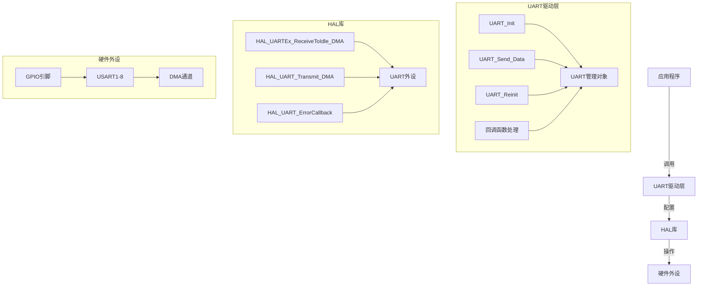
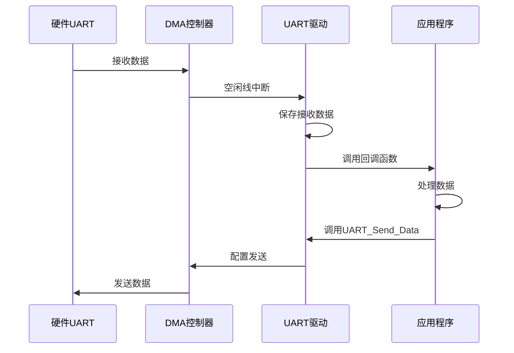
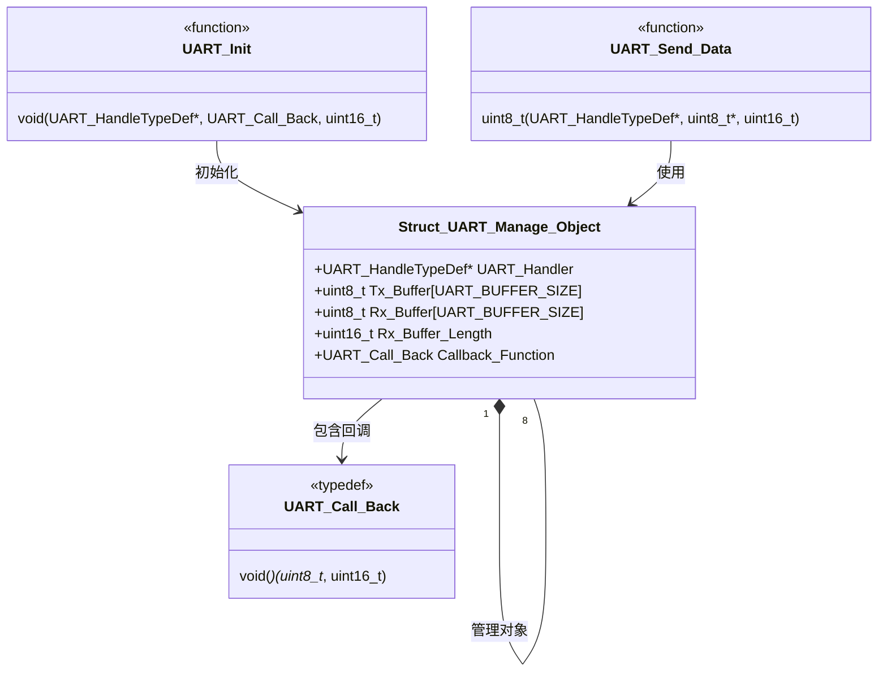

# STM32 HAL库UART与DMA驱动代码深度解析

## 一、STM32 HAL库UART和DMA相关核心函数

### 1. UART相关函数

#### **HAL_UART_Init()**

- **作用**：初始化UART外设
- **参数**：
  - `UART_HandleTypeDef *huart`：UART句柄指针

#### **HAL_UART_DeInit()**

- **作用**：反初始化UART外设
- **参数**：
  - `UART_HandleTypeDef *huart`：UART句柄指针

#### **HAL_UART_Transmit()**

- **作用**：阻塞式发送数据
- **参数**：
  - `UART_HandleTypeDef *huart`：UART句柄指针
  - `uint8_t *pData`：发送数据缓冲区指针
  - `uint16_t Size`：发送数据长度
  - `uint32_t Timeout`：超时时间

#### **HAL_UART_Receive()**

- **作用**：阻塞式接收数据
- **参数**：
  - `UART_HandleTypeDef *huart`：UART句柄指针
  - `uint8_t *pData`：接收数据缓冲区指针
  - `uint16_t Size`：接收数据长度
  - `uint32_t Timeout`：超时时间

#### **HAL_UART_Transmit_DMA()**

- **作用**：使用DMA发送数据
- **参数**：
  - `UART_HandleTypeDef *huart`：UART句柄指针
  - `uint8_t *pData`：发送数据缓冲区指针
  - `uint16_t Size`：发送数据长度
- **返回值**：`HAL_StatusTypeDef`（HAL_OK, HAL_ERROR, HAL_BUSY, HAL_TIMEOUT）

#### **HAL_UARTEx_ReceiveToIdle_DMA()**

- **作用**：使用DMA接收数据，当检测到空闲线时触发回调
- **参数**：
  - `UART_HandleTypeDef *huart`：UART句柄指针
  - `uint8_t *pData`：接收数据缓冲区指针
  - `uint16_t Size`：接收缓冲区大小
- **返回值**：`HAL_StatusTypeDef`

### 2. DMA相关函数

#### **HAL_DMA_Init()**

- **作用**：初始化DMA通道
- **参数**：
  - `DMA_HandleTypeDef *hdma`：DMA句柄指针

#### **HAL_DMA_Start()**

- **作用**：启动DMA传输
- **参数**：
  - `DMA_HandleTypeDef *hdma`：DMA句柄指针
  - `uint32_t SrcAddress`：源地址
  - `uint32_t DstAddress`：目标地址
  - `uint32_t DataLength`：数据长度

#### **HAL_DMA_Abort()**

- **作用**：中止DMA传输
- **参数**：
  - `DMA_HandleTypeDef *hdma`：DMA句柄指针

### 3. 中断回调函数

#### **HAL_UART_TxCpltCallback()**

- **作用**：发送完成回调函数
- **参数**：
  - `UART_HandleTypeDef *huart`：UART句柄指针

#### **HAL_UART_RxCpltCallback()**

- **作用**：接收完成回调函数
- **参数**：
  - `UART_HandleTypeDef *huart`：UART句柄指针

#### **HAL_UART_ErrorCallback()**

- **作用**：UART错误回调函数
- **参数**：
  - `UART_HandleTypeDef *huart`：UART句柄指针

#### **HAL_UARTEx_RxEventCallback()**

- **作用**：UART扩展接收事件回调函数（空闲线检测）
- **参数**：
  - `UART_HandleTypeDef *huart`：UART句柄指针
  - `uint16_t Size`：接收到的数据长度

------

## 二、代码深度解析

### 1. 头文件 `drv_uart.h` 解析

```c
/** 
 * @file drv_uart.h
 * @author yssickjgd (1345578933@qq.com)
 * @brief 仿照SCUT-Robotlab改写的UART通信初始化与配置流程
 * @version 0.1
 * @date 2023-08-29 0.1 23赛季定稿
 * @date 2023-11-18 1.1 修改成cpp
 * @date 2024-05-05 1.2 新增错误中断
 *
 * @copyright USTC-RoboWalker (c) 2023-2024
 */
```

**作用**：文件头注释，说明文件作者、功能、版本历史和版权信息。

------

```c
#ifndef DRV_UART_H
#define DRV_UART_H
```

**作用**：防止头文件重复包含的保护宏。

------

```c
#include "stm32f4xx_hal.h"
#include "usart.h"
#include <string.h>
```

**作用**：包含必要的头文件

- `stm32f4xx_hal.h`：STM32 HAL库核心头文件
- `usart.h`：UART外设配置头文件（通常由CubeMX生成）
- `string.h`：标准字符串处理函数

------

```c
#define UART_BUFFER_SIZE 512
```

**作用**：定义UART收发缓冲区大小为512字节，这是一个宏常量，便于统一修改。

------

```c
typedef void (*UART_Call_Back)(uint8_t *Buffer, uint16_t Length);
```

**作用**：定义回调函数类型

- **参数**：
  - `uint8_t *Buffer`：接收到的数据缓冲区指针
  - `uint16_t Length`：接收到的数据长度
- **返回值**：`void`（无返回值）
- **说明**：这是一个函数指针类型，用于注册用户自定义的接收处理函数

------

```c
struct Struct_UART_Manage_Object
{
    UART_HandleTypeDef *UART_Handler;
    uint8_t Tx_Buffer[UART_BUFFER_SIZE];
    uint8_t Rx_Buffer[UART_BUFFER_SIZE];
    uint16_t Rx_Buffer_Length;
    UART_Call_Back Callback_Function;
};
```

**作用**：定义UART管理对象结构体

- **成员变量说明**：
  - `UART_HandleTypeDef *UART_Handler`：指向HAL库UART句柄的指针
  - `uint8_t Tx_Buffer[UART_BUFFER_SIZE]`：发送缓冲区，大小为512字节
  - `uint8_t Rx_Buffer[UART_BUFFER_SIZE]`：接收缓冲区，大小为512字节
  - `uint16_t Rx_Buffer_Length`：接收缓冲区长度（实际使用大小）
  - `UART_Call_Back Callback_Function`：回调函数指针，用于处理接收到的数据

**作用域**：全局结构体类型，可在整个项目中使用。

------

```c
extern bool init_finished;
extern Struct_UART_Manage_Object UART1_Manage_Object;
// ...（其他UART对象声明）
```

**作用**：声明外部变量

- `init_finished`：系统初始化完成标志
- 8个UART管理对象：分别为UART1-UART8创建管理对象
- **作用域**：全局变量，可在多个源文件中访问

------

```c
void UART_Init(UART_HandleTypeDef *huart, UART_Call_Back Callback_Function, uint16_t Rx_Buffer_Length);
void UART_Reinit(UART_HandleTypeDef *huart);
uint8_t UART_Send_Data(UART_HandleTypeDef *huart, uint8_t *Data, uint16_t Length);
void TIM_1ms_UART_PeriodElapsedCallback();
```

**作用**：声明对外提供的函数接口

- **作用域**：全局函数，可在其他文件中调用

------

### 2. 源文件 `drv_uart.cpp` 解析

```c
Struct_UART_Manage_Object UART1_Manage_Object = {0};
// ...（其他UART对象定义）
```

**作用**：定义并初始化8个UART管理对象

- **初始化**：`{0}`表示将所有成员变量初始化为0或NULL
- **作用域**：全局变量，整个程序生命周期内有效
- **外设资源**：为每个UART外设分配独立的管理对象

------

```c
void UART_Init(UART_HandleTypeDef *huart, UART_Call_Back Callback_Function, uint16_t Rx_Buffer_Length)
{
    if (huart->Instance == USART1)
    {
        UART1_Manage_Object.UART_Handler = huart;
        UART1_Manage_Object.Callback_Function = Callback_Function;
        UART1_Manage_Object.Rx_Buffer_Length = Rx_Buffer_Length;
        HAL_UARTEx_ReceiveToIdle_DMA(huart, UART1_Manage_Object.Rx_Buffer, UART1_Manage_Object.Rx_Buffer_Length);
    }
    // ...（其他UART处理）
}
```

**作用**：初始化指定的UART外设

- **参数**：
  - `huart`：UART句柄指针
  - `Callback_Function`：用户回调函数
  - `Rx_Buffer_Length`：接收缓冲区长度
- **功能流程**：
  1. 通过`huart->Instance`判断是哪个UART外设
  2. 将传入的参数保存到对应的管理对象中
  3. 调用`HAL_UARTEx_ReceiveToIdle_DMA()`启动DMA接收，配置空闲线检测
- **关键点**：
  - 使用空闲线检测(IDLE)实现不定长数据接收
  - 每个UART有独立的配置，互不影响
- **外设资源**：占用对应的UART外设和DMA通道

------

```c
void UART_Reinit(UART_HandleTypeDef *huart)
{
    if (huart->Instance == USART1)
    {
        HAL_UARTEx_ReceiveToIdle_DMA(huart, UART1_Manage_Object.Rx_Buffer, UART1_Manage_Object.Rx_Buffer_Length);
    }
    // ...（其他UART处理）
}
```

**作用**：重新初始化UART接收

- **使用场景**：当UART通信异常或掉线时重新启动接收
- **功能**：重新配置DMA接收，使用之前保存的缓冲区和长度
- **外设资源**：重新配置对应的UART和DMA

------

```c
uint8_t UART_Send_Data(UART_HandleTypeDef *huart, uint8_t *Data, uint16_t Length)
{
    return (HAL_UART_Transmit_DMA(huart, Data, Length));
}
```

**作用**：通过DMA发送数据

- **参数**：
  - `huart`：UART句柄指针
  - `Data`：要发送的数据指针
  - `Length`：数据长度
- **返回值**：`HAL_UART_Transmit_DMA()`的返回状态
- **外设资源**：占用UART的DMA发送通道

------

```c
void HAL_UARTEx_RxEventCallback(UART_HandleTypeDef *huart, uint16_t Size)
{
    if (init_finished == false)
    {
        return;
    }
    
    if (huart->Instance == USART1)
    {
        if(UART1_Manage_Object.Callback_Function != nullptr)
        {
            UART1_Manage_Object.Callback_Function(UART1_Manage_Object.Rx_Buffer, Size);
        }
        HAL_UARTEx_ReceiveToIdle_DMA(huart, UART1_Manage_Object.Rx_Buffer, UART1_Manage_Object.Rx_Buffer_Length);
    }
    // ...（其他UART处理）
}
```

**作用**：UART接收事件回调函数（空闲线中断）

- **触发条件**：当UART检测到空闲线(IDLE)时触发
- **功能流程**：
  1. 检查系统是否初始化完成
  2. 根据UART实例选择对应的管理对象
  3. 检查回调函数指针是否为空
  4. 调用用户注册的回调函数处理接收到的数据
  5. 重新启动DMA接收，准备下一次数据接收
- **关键特性**：
  - 空指针保护：`if(UART1_Manage_Object.Callback_Function != nullptr)`
  - 自动重启接收：确保持续接收数据
- **外设资源**：使用UART的IDLE中断和DMA接收

------

```c
void HAL_UART_ErrorCallback(UART_HandleTypeDef *huart)
{
    if (huart->Instance == USART1)
    {
        HAL_UARTEx_ReceiveToIdle_DMA(huart, UART1_Manage_Object.Rx_Buffer, UART1_Manage_Object.Rx_Buffer_Length);
    }
    // ...（其他UART处理）
}
```

**作用**：UART错误中断回调函数

- **触发条件**：当UART发生错误（如帧错误、溢出错误等）时触发
- **功能**：重新启动DMA接收，恢复通信
- **设计思想**：自动错误恢复机制，提高系统鲁棒性
- **外设资源**：UART错误中断，DMA接收通道

------

## 三、系统架构图



## 四、数据流图



## 五、类关系图



## 六、关键设计特点总结

### 1. **模块化设计**

- 每个UART外设有独立的管理对象
- 统一的接口函数，易于扩展和维护

### 2. **高效数据接收**

- 使用DMA + 空闲线检测(IDLE)实现高效不定长数据接收
- 零拷贝设计，直接在DMA缓冲区处理数据

### 3. **异常处理机制**

- 错误中断自动恢复
- 空指针保护，防止程序崩溃
- 初始化完成标志保护

### 4. **资源管理**

- 预分配固定大小的缓冲区，避免动态内存分配
- 每个UART独占资源，避免竞争条件

### 5. **扩展性**

- 支持8个UART外设
- 通过回调函数机制，易于集成到不同应用

### 6. **性能优化**

- DMA传输减少CPU负担
- 中断驱动架构，提高响应速度

## 七、使用示例

```c
// 用户回调函数
void My_UART_Callback(uint8_t *buffer, uint16_t length) {
    // 处理接收到的数据
    Process_Received_Data(buffer, length);
}

// 初始化UART
UART_Init(&huart1, My_UART_Callback, 512);

// 发送数据
uint8_t tx_data[] = {0x01, 0x02, 0x03};
UART_Send_Data(&huart1, tx_data, sizeof(tx_data));
```

## 八、注意事项

1. **缓冲区大小**：`UART_BUFFER_SIZE`需要根据实际应用需求调整
2. **回调函数**：用户必须提供有效的回调函数，或检查空指针
3. **初始化顺序**：必须在系统初始化完成后调用UART相关函数
4. **DMA配置**：需要在CubeMX中正确配置UART的DMA通道
5. **中断优先级**：UART中断优先级需要合理设置，避免影响其他关键任务

这个驱动代码体现了现代嵌入式系统设计的良好实践，通过抽象层封装硬件细节，提供统一的接口，同时保持高效和可靠的数据通信能力。