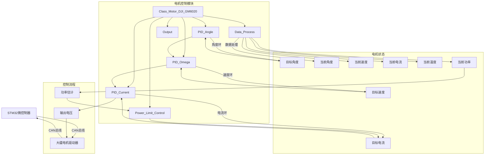
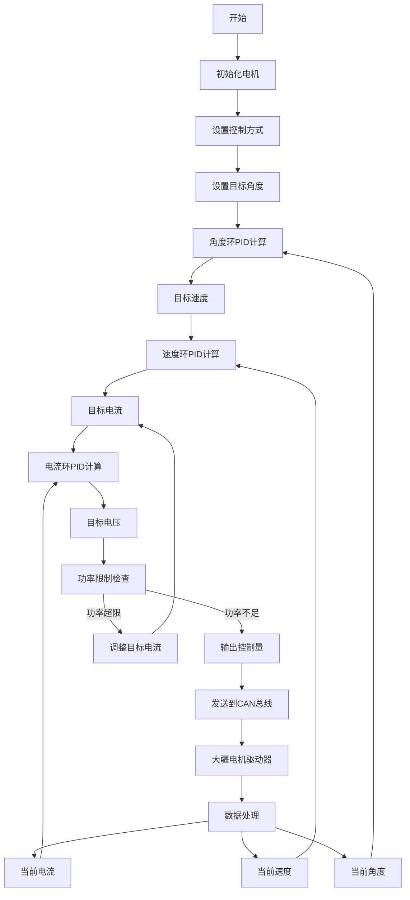

# 大疆电机驱动库代码解析

## 一、STM32 HAL库中使用的函数

以下是代码中使用到的STM32 HAL库相关函数和自定义函数：

1. **`CAN_HandleTypeDef`** - STM32 HAL库中的CAN外设句柄，用于配置和控制CAN总线通信

2. **`Math_Constrain`** - 自定义函数，用于限制数值范围

   ```c
   void Math_Constrain(float *value, float min, float max) {
       if (*value < min) *value = min;
       if (*value > max) *value = max;
   }
   ```

3. **`RPM_TO_RADPS`** - 自定义常量，用于将RPM(转/分钟)转换为rad/s(弧度/秒)

   ```c
   #define RPM_TO_RADPS (2.0f * PI / 60.0f)
   ```

4. **`CELSIUS_TO_KELVIN`** - 自定义常量，用于将摄氏度转换为开尔文

   ```c
   #define CELSIUS_TO_KELVIN 273.15f
   ```

5. **`Math_Endian_Reverse_16`** - 自定义函数，用于处理16位数据的大小端字节序

6. **`arm_sqrt_f32`** - ARM CMSIS库中的浮点平方根函数

7. **`Math_Abs`** - 自定义函数，用于获取浮点数的绝对值

## 二、代码结构与关键类解析

### 1. 文件结构

```
dvc_motor_dji.h  - 头文件，定义电机驱动类、枚举和结构体
dvc_motor_dji.cpp - 实现文件，实现电机驱动类的方法
```

### 2. 关键类与作用

#### 2.1 `Class_Motor_DJI_GM6020` - GM6020电机驱动类

**作用域**：用于控制大疆GM6020无刷电机，支持电压控制和电流控制两种模式

**外设资源**：

- CAN总线（CAN1或CAN2）
- 电机编码器（通过CAN接收数据获取）

**关键成员变量**：

- `PID_Angle`：角度环PID控制器
- `PID_Omega`：角速度环PID控制器
- `PID_Current`：电流环PID控制器
- `Voltage_Max`：最大输出电压
- `Current_Max`：最大输出电流
- `Power_K_0, Power_K_1, Power_K_2, Power_A`：功率计算系数

**关键成员函数**：

- `Init`：初始化电机
- `CAN_RxCpltCallback`：CAN接收完成回调函数
- `TIM_100ms_Alive_PeriodElapsedCallback`：100ms定时器回调，检测电机是否在线
- `TIM_Calculate_PeriodElapsedCallback`：计算周期定时器回调
- `Data_Process`：数据处理函数
- `PID_Calculate`：PID控制计算
- `Power_Limit_Control`：功率限制控制
- `Output`：将控制量输出到CAN总线

#### 2.2 `Class_Motor_DJI_C610` - C610电机驱动类

**作用域**：用于控制大疆C610无刷电机，自带电流环，单片机控制输出电流

**外设资源**：

- CAN总线（CAN1或CAN2）
- 电机编码器（通过CAN接收数据获取）

**关键成员变量**：

- `PID_Angle`：角度环PID控制器
- `PID_Omega`：角速度环PID控制器
- `Gearbox_Rate`：减速比
- `Current_Max`：最大输出电流

**关键成员函数**：

- `Init`：初始化电机
- `CAN_RxCpltCallback`：CAN接收完成回调函数
- `TIM_100ms_Alive_PeriodElapsedCallback`：100ms定时器回调，检测电机是否在线
- `TIM_Calculate_PeriodElapsedCallback`：计算周期定时器回调
- `Data_Process`：数据处理函数
- `PID_Calculate`：PID控制计算

#### 2.3 `Class_Motor_DJI_C620` - C620电机驱动类

**作用域**：用于控制大疆C620无刷电机，自带电流环，单片机控制输出电流，支持功率限制

**外设资源**：

- CAN总线（CAN1或CAN2）
- 电机编码器（通过CAN接收数据获取）

**关键成员变量**：

- `PID_Angle`：角度环PID控制器
- `PID_Omega`：角速度环PID控制器
- `Gearbox_Rate`：减速比
- `Power_Limit_Status`：功率限制状态
- `Power_K_0, Power_K_1, Power_K_2, Power_A`：功率计算系数

**关键成员函数**：

- `Init`：初始化电机
- `CAN_RxCpltCallback`：CAN接收完成回调函数
- `TIM_100ms_Alive_PeriodElapsedCallback`：100ms定时器回调，检测电机是否在线
- `TIM_Calculate_PeriodElapsedCallback`：计算周期定时器回调
- `TIM_Power_Limit_After_Calculate_PeriodElapsedCallback`：功率限制后计算回调
- `Data_Process`：数据处理函数
- `PID_Calculate`：PID控制计算
- `Power_Limit_Control`：功率限制控制
- `Output`：将控制量输出到CAN总线

## 三、代码深度解析

### 1. 电机控制模式

```cpp
enum Enum_Motor_DJI_Control_Method{
    Motor_DJI_Control_Method_VOLTAGE = 0,  // 电压控制
    Motor_DJI_Control_Method_CURRENT,     // 电流控制
    Motor_DJI_Control_Method_TORQUE,      // 扭矩控制
    Motor_DJI_Control_Method_OMEGA,       // 角速度控制
    Motor_DJI_Control_Method_ANGLE,       // 角度控制
};
```

**控制模式说明**：

- `VOLTAGE`：直接控制输出电压
- `CURRENT`：控制输出电流
- `OMEGA`：控制角速度
- `ANGLE`：控制角度

### 2. 电机驱动版本

```cpp
enum Enum_Motor_DJI_GM6020_Driver_Version{
    Motor_DJI_GM6020_Driver_Version_DEFAULT = 0,  // 旧版驱动（电压控制）
    Motor_DJI_GM6020_Driver_Version_2023,         // 新版驱动（电流控制）
};
```

**驱动版本说明**：

- `DEFAULT`：旧版驱动，使用电压控制模式
- `2023`：新版驱动，使用电流控制模式

### 3. 电机状态

```cpp
enum Enum_Motor_DJI_Status{
    Motor_DJI_Status_DISABLE = 0,  // 电机禁用
    Motor_DJI_Status_ENABLE,       // 电机启用
};
```

### 4. 电机数据结构

```cpp
struct Struct_Motor_DJI_CAN_Rx_Data{
    uint16_t Encoder_Reverse;     // 编码器值（反转）
    int16_t Omega_Reverse;        // 角速度（反转）
    int16_t Current_Reverse;      // 电流（反转）
    uint8_t Temperature;          // 温度
    uint8_t Reserved;             // 保留
} __attribute__((packed));
struct Struct_Motor_DJI_Rx_Data{
    float Now_Angle;              // 当前角度
    float Now_Omega;              // 当前角速度
    float Now_Current;            // 当前电流
    float Now_Temperature;        // 当前温度
    float Now_Power;              // 当前功率
    uint32_t Pre_Encoder;         // 前一时刻编码器值
    int32_t Total_Encoder;        // 总编码器值
    int32_t Total_Round;          // 总圈数
};
```

### 5. 电机初始化函数 (`Init`)

```cpp
void Class_Motor_DJI_GM6020::Init(CAN_HandleTypeDef *hcan, Enum_Motor_DJI_ID __CAN_Rx_ID, 
                                 Enum_Motor_DJI_Control_Method __Motor_DJI_Control_Method = Motor_DJI_Control_Method_ANGLE, 
                                 int32_t __Encoder_Offset = 0, 
                                 Enum_Motor_DJI_GM6020_Driver_Version __Drive_Version = Motor_DJI_GM6020_Driver_Version_DEFAULT,
                                 Enum_Motor_DJI_Power_Limit_Status __Power_Limit_Status = Motor_DJI_Power_Limit_Status_DISABLE,
                                 float __Voltage_Max = 24.0f, 
                                 float __Current_Max = 3.0f)
```

**功能**：初始化电机驱动参数

**关键步骤**：

1. 确定CAN总线（CAN1或CAN2）
2. 设置电机ID
3. 设置控制方式
4. 设置编码器偏移
5. 设置驱动版本
6. 设置功率限制状态
7. 设置最大电压和电流
8. 分配发送缓冲区

### 6. 数据处理函数 (`Data_Process`)

```cpp
void Class_Motor_DJI_GM6020::Data_Process()
```

**功能**：处理从CAN接收的数据，计算电机状态

**关键步骤**：

1. 反转数据大小端（处理字节序）
2. 计算编码器变化量
3. 计算总编码器值和总圈数
4. 计算当前角度、角速度、电流和温度
5. 计算当前功率

### 7. PID控制计算 (`PID_Calculate`)

```cpp
void Class_Motor_DJI_GM6020::PID_Calculate()
```

**功能**：根据控制方式计算PID控制输出

**关键逻辑**：

```cpp
switch (Motor_DJI_Control_Method) {
    case Motor_DJI_Control_Method_ANGLE: // 角度控制
        PID_Angle.Set_Target(Target_Angle);
        PID_Angle.Set_Now(Rx_Data.Now_Angle);
        PID_Angle.TIM_Calculate_PeriodElapsedCallback();
        Target_Omega = PID_Angle.Get_Out();
        
        PID_Omega.Set_Target(Target_Omega + Feedforward_Omega);
        PID_Omega.Set_Now(Rx_Data.Now_Omega);
        PID_Omega.TIM_Calculate_PeriodElapsedCallback();
        Target_Current = PID_Omega.Get_Out();
        
        PID_Current.Set_Target(Target_Current + Feedforward_Current);
        PID_Current.Set_Now(Rx_Data.Now_Current);
        PID_Current.TIM_Calculate_PeriodElapsedCallback();
        Target_Voltage = PID_Current.Get_Out();
        break;
    // 其他控制方式类似
}
```

**控制环路**：

- 角度控制：角度环 → 速度环 → 电流环 → 电压输出
- 速度控制：速度环 → 电流环 → 电压输出
- 电流控制：电流环 → 电压输出

### 8. 功率限制控制 (`Power_Limit_Control`)

```cpp
void Class_Motor_DJI_GM6020::Power_Limit_Control()
```

**功能**：当开启功率限制时，根据功率估计值调整电流目标

**关键逻辑**：

```cpp
if (Power_Estimate > 0.0f) {
    if (Power_Factor >= 1.0f) {
        // 无需功率控制
    } else {
        // 需要功率控制
        // 根据功率估计公式解一元二次方程求电流值
        float a = Power_K_2;
        float b = Power_K_0 * Rx_Data.Now_Omega;
        float c = Power_A + Power_K_1 * Rx_Data.Now_Omega * Rx_Data.Now_Omega - Power_Factor * Power_Estimate;
        float delta, h;
        delta = b * b - 4 * a * c;
        
        if (delta < 0.0f) {
            // 无解
            Target_Current = 0.0f;
        } else {
            arm_sqrt_f32(delta, &h);
            float result_1, result_2;
            result_1 = (-b + h) / (2.0f * a);
            result_2 = (-b - h) / (2.0f * a);
            
            // 选择合适的电流值
            if ((result_1 > 0.0f && result_2 < 0.0f) || (result_1 < 0.0f && result_2 > 0.0f)) {
                if ((Target_Current > 0.0f && result_1 > 0.0f) || (Target_Current < 0.0f && result_1 < 0.0f)) {
                    Target_Current = result_1;
                } else {
                    Target_Current = result_2;
                }
            } else {
                if (Math_Abs(result_1) < Math_Abs(result_2)) {
                    Target_Current = result_1;
                } else {
                    Target_Current = result_2;
                }
            }
        }
    }
}
```

**功率估计公式**： `Power = K_0 * Current * Omega + K_1 * Omega^2 + K_2 * Current^2 + A`

### 9. 电机数据输出 (`Output`)

```cpp
void Class_Motor_DJI_GM6020::Output()
{
    Tx_Data[0] = (int16_t) Out >> 8;
    Tx_Data[1] = (int16_t) Out;
}
```

**功能**：将控制量输出到CAN总线发送缓冲区

**关键逻辑**：

- 将16位整数的高8位和低8位分别存储到发送缓冲区的两个字节
- 用于发送到电机驱动器

## 四、系统框架图



## 五、关键控制流程图



## 六、电机驱动工作流程

1. **初始化阶段**：
   - 配置CAN总线
   - 设置电机ID和控制方式
   - 初始化PID控制器
   - 分配发送缓冲区
2. **数据接收阶段**：
   - 通过CAN接收电机反馈数据
   - 处理大小端字节序
   - 计算当前电机状态（角度、速度、电流、温度）
3. **控制计算阶段**：
   - 根据控制方式计算PID输出
   - 角度控制：角度环 → 速度环 → 电流环
   - 速度控制：速度环 → 电流环
   - 电流控制：电流环
4. **功率限制阶段**（如果启用）：
   - 计算当前功率
   - 根据功率限制调整目标电流
5. **数据输出阶段**：
   - 将控制量转换为CAN发送格式
   - 发送到电机驱动器

## 七、关键参数说明

| 参数                    | 说明                 | 默认值   | 单位  |
| ----------------------- | -------------------- | -------- | ----- |
| `Encoder_Num_Per_Round` | 一圈编码器刻度       | 8192     | 无    |
| `Voltage_To_Out`        | 电压到输出的转化系数 | 25000/24 | 无    |
| `Current_To_Out`        | 电流到输出的转化系数 | 16384/3  | 无    |
| `Power_K_0`             | 功率计算系数         | 0.8130   | 无    |
| `Power_K_1`             | 功率计算系数         | -0.0005  | 无    |
| `Power_K_2`             | 功率计算系数         | 6.0021   | 无    |
| `Power_A`               | 功率计算系数         | 1.3715   | 无    |
| `RPM_TO_RADPS`          | RPM转rad/s           | 2π/60    | rad/s |
| `CELSIUS_TO_KELVIN`     | 摄氏度转开尔文       | 273.15   | K     |

## 八、总结

这个大疆电机驱动库是一个完整的电机控制解决方案，提供了以下关键功能：

1. **多种控制模式**：电压控制、电流控制、角度控制、速度控制
2. **电机状态监测**：角度、速度、电流、温度、功率
3. **PID控制环**：角度环、速度环、电流环
4. **功率限制**：防止电机过热，保护电机
5. **双驱动版本支持**：旧版电压控制和新版电流控制

该库采用面向对象设计，通过类封装电机控制逻辑，使得代码结构清晰，易于使用和扩展。通过CAN总线与大疆电机驱动器通信，实现了对电机的精确控制。

在实际应用中，用户只需要创建相应的电机对象，设置必要的参数，然后调用相应的控制函数即可实现对电机的控制，大大简化了电机控制的开发难度。