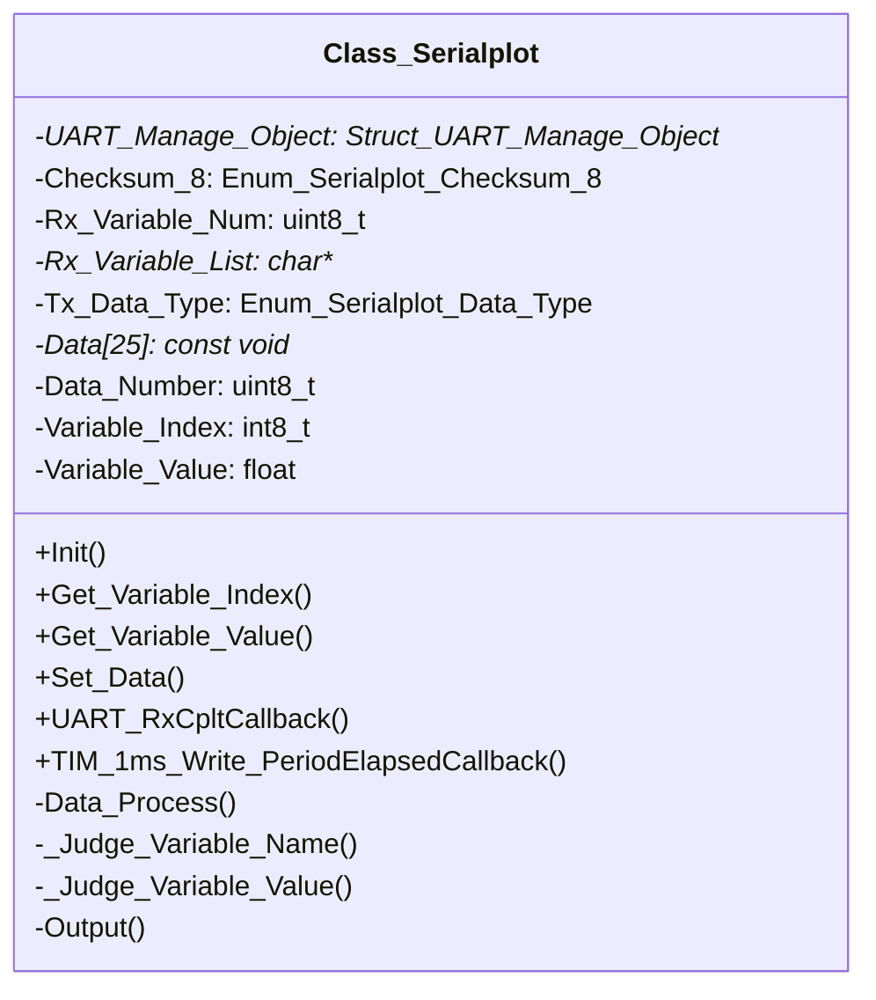
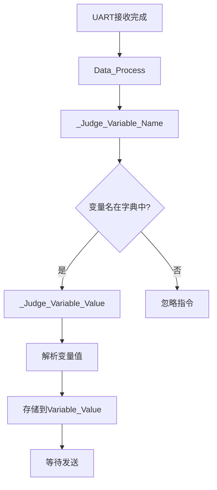
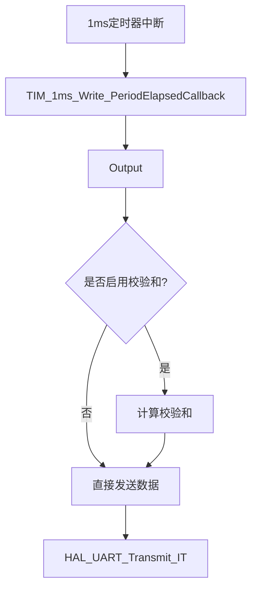

# 串口绘图工具深度解析

## 一、程序概述

这是一个用于嵌入式系统的串口绘图工具（Class_Serialplot），主要用于将嵌入式设备中的数据通过串口发送到上位机（如Vofa+串口调试软件），实现数据可视化。该工具支持多种数据类型（uint8/uint16/float等），最多支持25个变量通道。

## 二、核心类结构分析

### Class_Serialplot 类结构图



## 三、关键组件深度解析00

### 1. 头文件 (dvc_serialplot.h) 解析

#### 1.1 宏定义

```c
#define SERIALPLOT_RX_VARIABLE_ASSIGNMENT_MAX_LENGTH (100)
```

- 定义了单条串口指令的最大长度（100字节）
- 用于限制变量名长度，防止缓冲区溢出

#### 1.2 枚举类型

```c
enum Enum_Serialplot_Checksum_8 {
    Serialplot_Checksum_8_DISABLE = 0,
    Serialplot_Checksum_8_ENABLE,
};
```

- 控制是否启用8位校验和
- `DISABLE`：不启用校验和
- `ENABLE`：启用校验和

```c
enum Enum_Serialplot_Data_Type {
    Serialplot_Data_Type_UINT8 = 0,
    Serialplot_Data_Type_UINT16,
    Serialplot_Data_Type_UINT32,
    Serialplot_Data_Type_INT8,
    Serialplot_Data_Type_INT16,
    Serialplot_Data_Type_INT32,
    Serialplot_Data_Type_FLOAT,
    Serialplot_Data_Type_DOUBLE,
};
```

- 定义了8种数据类型
- 用于指定发送数据的格式
- `FLOAT` 是默认传输类型（用于Vofa+适配）

#### 1.3 Class_Serialplot 类

**成员变量说明**：

| 成员变量           | 类型                       | 说明                       |
| ------------------ | -------------------------- | -------------------------- |
| UART_Manage_Object | Struct_UART_Manage_Object* | UART管理对象指针           |
| Checksum_8         | Enum_Serialplot_Checksum_8 | 校验和启用状态             |
| Rx_Variable_Num    | uint8_t                    | 接收指令字典数量           |
| Rx_Variable_List   | char**                     | 接收指令字典列表指针       |
| Tx_Data_Type       | Enum_Serialplot_Data_Type  | 发送数据类型               |
| Data[25]           | const void*                | 数据指针数组，最多25个变量 |
| Data_Number        | uint8_t                    | 当前发送的数据数量         |
| Variable_Index     | int8_t                     | 当前接收指令在字典中的索引 |
| Variable_Value     | float                      | 当前接收指令的值           |

**公有成员函数**：

```c
void Init(UART_HandleTypeDef *huart, Enum_Serialplot_Checksum_8 __Checksum_8 = Serialplot_Checksum_8_ENABLE, 
          uint8_t __Rx_Variable_Assignment_Num = 0, char **__Rx_Variable_Assignment_List = NULL, 
          Enum_Serialplot_Data_Type __Data_Type = Serialplot_Data_Type_FLOAT);
```

- 初始化串口绘图对象
- 参数说明：
  - `huart`: 指定的UART外设
  - `__Checksum_8`: 是否启用校验和（默认启用）
  - `__Rx_Variable_Assignment_Num`: 接收指令字典数量
  - `__Rx_Variable_Assignment_List`: 接收指令字典列表
  - `__Data_Type`: 数据类型（默认float）

```c
inline int8_t Get_Variable_Index();
```

- 获取当前接收指令在指令字典中的索引

```c
inline float Get_Variable_Value();
```

- 获取当前接收指令的值

```c
inline void Set_Data(uint8_t Number, ...);
```

- 添加需要发送的数据
- 参数说明：
  - `Number`: 需要发送的数据数量
  - `...`: 数据指针列表（可变参数）

```c
void UART_RxCpltCallback(uint8_t *Rx_Data, uint16_t Length);
```

- UART接收完成回调函数
- 处理接收到的指令

```c
void TIM_1ms_Write_PeriodElapsedCallback();
```

- 1ms定时器中断回调
- 定期发送数据到串口

## 四、实现文件 (dvc_serialplot.cpp) 详解

### 1. 初始化函数 (Init)

```c
void Class_Serialplot::Init(UART_HandleTypeDef *huart, Enum_Serialplot_Checksum_8 __Checksum_8, 
                           uint8_t __Rx_Variable_Assignment_Num, char **__Rx_Variable_Assignment_List, 
                           Enum_Serialplot_Data_Type __Data_Type)
{
    // 根据UART外设实例绑定UART管理对象
    if (huart->Instance == USART1) {
        UART_Manage_Object = &UART1_Manage_Object;
    } else if (huart->Instance == USART2) {
        UART_Manage_Object = &UART2_Manage_Object;
    } // ... 其他UART实例处理
    
    Checksum_8 = __Checksum_8;
    Rx_Variable_Num = __Rx_Variable_Assignment_Num;
    Rx_Variable_List = __Rx_Variable_Assignment_List;
    Tx_Data_Type = __Data_Type;
}
```

**功能**：初始化串口绘图对象，绑定UART管理对象，设置校验和、变量字典和数据类型。

**关键点**：

- 通过UART实例（USART1、USART2等）选择对应的UART管理对象
- 为每个UART外设创建了独立的管理对象（UART1_Manage_Object等）

### 2. 数据处理流程

#### 数据接收处理流程图



#### 1. Data_Process 函数

```c
void Class_Serialplot::Data_Process(uint16_t Length)
{
    int flag;
    flag = _Judge_Variable_Name(Length);
    _Judge_Variable_Value(Length, flag);
}
```

**功能**：处理接收到的串口数据，判断变量名和值。

#### 2. _Judge_Variable_Name 函数

```c
uint8_t Class_Serialplot::_Judge_Variable_Name(uint16_t Length)
{
    char tmp_variable_name[SERIALPLOT_RX_VARIABLE_ASSIGNMENT_MAX_LENGTH];
    int flag;
    for (flag = 0; UART_Manage_Object->Rx_Buffer[flag] != '=' && flag < Length; flag++) {
        tmp_variable_name[flag] = UART_Manage_Object->Rx_Buffer[flag];
    }
    tmp_variable_name[flag] = 0;
    
    for (int i = 0; i < Rx_Variable_Num; i++) {
        if (strcmp(tmp_variable_name, (char *)((int)Rx_Variable_List + SERIALPLOT_RX_VARIABLE_ASSIGNMENT_MAX_LENGTH * i)) == 0) {
            Variable_Index = i;
            return (flag + 1);
        }
    }
    Variable_Index = -1;
    return (flag + 1);
}
```

**功能**：判断接收到的变量名是否在指令字典中。

- 从接收到的数据中提取变量名（直到'='之前）
- 与指令字典比较，查找匹配的变量名
- 如果找到，返回变量名在指令中的位置（等号位置）
- 如果未找到，返回-1

#### 3. _Judge_Variable_Value 函数

```c
void Class_Serialplot::_Judge_Variable_Value(uint16_t Length, int flag)
{
    int tmp_dot_flag = 0, tmp_sign_coefficient = 1, i;
    Variable_Value = 0.0f;
    
    if (Variable_Index == -1) {
        return;
    }
    
    if (UART_Manage_Object->Rx_Buffer[flag] == '-') {
        tmp_sign_coefficient = -1;
        flag++;
    }
    
    for (i = flag; UART_Manage_Object->Rx_Buffer[i] != '#' && i < Length; i++) {
        if (UART_Manage_Object->Rx_Buffer[i] == '.') {
            tmp_dot_flag = i;
        } else {
            Variable_Value = Variable_Value * 10.0f + (UART_Manage_Object->Rx_Buffer[i] - '0');
        }
    }
    
    if (tmp_dot_flag != 0) {
        Variable_Value /= pow(10.0f, i - tmp_dot_flag - 1.0f);
    }
    Variable_Value *= tmp_sign_coefficient;
}
```

**功能**：解析变量值。

- 处理负号（如果存在）
- 逐位解析数字
- 处理小数点（如果有）
- 乘以符号系数

### 3. 数据发送流程

#### 数据发送流程图



#### 1. TIM_1ms_Write_PeriodElapsedCallback 函数

```c
void Class_Serialplot::TIM_1ms_Write_PeriodElapsedCallback()
{
    Output();
    size_t data_length = 0;
    if (Checksum_8 == Serialplot_Checksum_8_ENABLE) {
        data_length++;
    }
    
    switch (Tx_Data_Type) {
        case Serialplot_Data_Type_UINT8:
            data_length += Data_Number * sizeof(uint8_t);
            break;
        // ... 其他数据类型处理
    }
    
    HAL_UART_Transmit_IT(UART_Manage_Object->UART_Handler, UART_Manage_Object->Tx_Buffer, data_length);
}
```

**功能**：1ms定时器中断回调，触发数据发送。

- 调用Output()准备数据
- 计算数据长度（包括校验和）
- 通过HAL_UART_Transmit_IT发送数据

#### 2. Output 函数

```c
void Class_Serialplot::Output()
{
    uint8_t *tmp_buffer = UART_Manage_Object->Tx_Buffer;
    memset(tmp_buffer, 0, UART_BUFFER_SIZE);
    
    switch (Tx_Data_Type) {
        case Serialplot_Data_Type_UINT8:
        case Serialplot_Data_Type_INT8:
            for (int i = 0; i < Data_Number; i++) {
                memcpy(tmp_buffer + i * sizeof(uint8_t), Data[i], sizeof(uint8_t));
            }
            if (Checksum_8 != Serialplot_Checksum_8_DISABLE) {
                tmp_buffer[Data_Number * sizeof(uint8_t)] = Math_Sum_8(tmp_buffer, Data_Number * sizeof(uint8_t));
            }
            break;
        // ... 其他数据类型处理
    }
}
```

**功能**：将数据填充到UART发送缓冲区。

- 根据数据类型（uint8、uint16、float等）进行数据拷贝
- 如果启用校验和，计算并附加8位校验和

## 五、串口数据格式说明

### 接收指令格式

```
variable_name=value#
```

- 示例：`angle=30.5#`
- `variable_name`：在指令字典中定义的变量名
- `=`：分隔符
- `value`：数值（可以是整数或浮点数）
- `#`：指令结束符

### 发送数据格式

- 二进制数据（根据指定的数据类型）
- 如果启用校验和，附加一个8位校验和字节

## 六、外设资源使用

| 外设         | 用途         | 说明                                |
| ------------ | ------------ | ----------------------------------- |
| UART         | 串口通信     | 用于发送数据到上位机（Vofa+等）     |
| 定时器       | 数据发送控制 | 1ms定时中断，定期发送数据           |
| 串口调试软件 | 数据可视化   | 如Vofa+，接收并显示数据             |
| 内存         | 数据存储     | 用于存储变量名字典、接收/发送缓冲区 |

## 七、使用示例

### 初始化示例

```c
// 定义变量字典
char *variable_dict[] = {"angle", "speed", "temperature"};

// 创建串口绘图对象
Class_Serialplot serialplot;

// 初始化，使用USART1，启用校验和，3个变量，float类型
serialplot.Init(&huart1, Serialplot_Checksum_8_ENABLE, 3, variable_dict, Serialplot_Data_Type_FLOAT);
```

### 添加数据示例

```c
// 定义要发送的数据
float angle = 30.5;
float speed = 15.2;
float temperature = 25.0;

// 添加数据到发送队列
serialplot.Set_Data(3, &angle, &speed, &temperature);
```

### 接收指令示例

```
angle=30.5#
speed=15.2#
temperature=25.0#
```

## 八、总结

这个串口绘图工具是一个轻量级的嵌入式数据可视化解决方案，具有以下特点：

1. **轻量级**：仅需少量内存（25个变量指针）
2. **灵活**：支持多种数据类型（uint8/uint16/float等）
3. **易用**：通过简单API实现数据发送
4. **兼容性**：适配Vofa+串口调试软件
5. **可靠性**：支持校验和，确保数据完整性

**典型应用场景**：机器人控制系统、嵌入式数据监测系统、传感器数据可视化等。

**工作流程**：

1. 嵌入式设备通过UART发送数据到上位机
2. 上位机（如Vofa+）接收数据并可视化
3. 用户可以在上位机查看实时数据曲线

该工具特别适合在资源受限的嵌入式系统中使用，提供了一个简单有效的数据可视化解决方案。