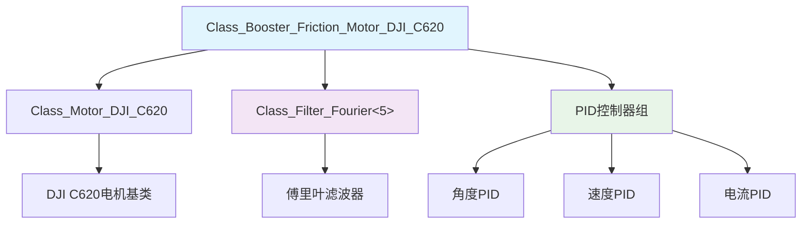
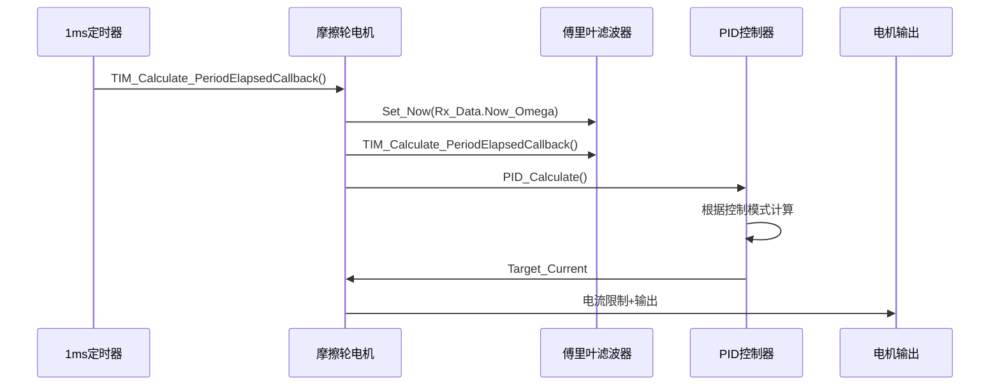
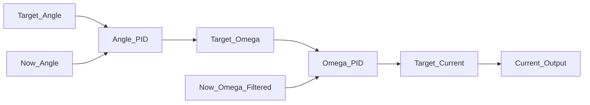

# 摩擦轮电机驱动代码深度解析

## 1. 系统架构图



## 2. 头文件分析 (crt_booster_motor.h)

### 2.1 文件概述

这是一个用于摩擦轮电机的特殊化驱动头文件，版本0.1于2024年7月新增，继承自DJI C620电机类并增加了傅里叶滤波器。

### 2.2 包含的头文件

```cpp
#include "2_Device/Motor/Motor_DJI/dvc_motor_dji.h"    // DJI电机驱动库
#include "1_Middleware/2_Algorithm/Filter/alg_filter.h" // 滤波算法库
```

### 2.3 前向声明

```cpp
class Class_Posture;                                   // 姿态类
class Class_Gimbal_Pitch_Motor_DJI_GM6020;           // 云台俯仰电机
```

**作用**: 避免循环包含，声明后续可能用到的类。

### 2.4 摩擦轮电机类定义

#### 2.4.1 类继承结构

```cpp
class Class_Booster_Friction_Motor_DJI_C620 : public Class_Motor_DJI_C620
```

**作用**: 继承DJI C620电机的所有功能，并在此基础上扩展。

#### 2.4.2 公共接口

```cpp
public:
    Class_Filter_Fourier<5> Filter_Fourier_Omega;  // 5阶傅里叶滤波器

    inline float Get_Now_Filter_Omega();           // 获取滤波后的速度
    void TIM_Calculate_PeriodElapsedCallback();    // 定时器计算回调
```

#### 2.4.3 保护成员变量

```cpp
protected:
    // 读变量

    // 写变量

    // 读写变量

    // 内部函数
    void PID_Calculate();  // PID计算函数
```

#### 2.4.4 内联函数实现

```cpp
inline float Class_Booster_Friction_Motor_DJI_C620::Get_Now_Filter_Omega()
{
    return (Filter_Fourier_Omega.Get_Out());
}
```

**作用**: 获取经过傅里叶滤波后的当前角速度。

## 3. 实现文件分析 (crt_booster_motor.cpp)

### 3.1 主要回调函数

#### 3.1.1 定时器计算回调函数

```cpp
void Class_Booster_Friction_Motor_DJI_C620::TIM_Calculate_PeriodElapsedCallback()
{
    // 步骤1: 滤波器处理
    Filter_Fourier_Omega.Set_Now(Rx_Data.Now_Omega);  // 设置当前速度值
    Filter_Fourier_Omega.TIM_Calculate_PeriodElapsedCallback();  // 执行滤波计算

    // 步骤2: PID计算
    PID_Calculate();

    // 步骤3: 电流限制和输出
    float tmp_value = Target_Current + Feedforward_Current;  // 目标电流+前馈电流
    Math_Constrain(&tmp_value, -Current_Max, Current_Max);   // 电流限制
    Out = tmp_value * Current_To_Out;                        // 转换为输出值

    Output();  // 输出到电机
}
```

**作用**: 摩擦轮电机的主要控制循环，执行滤波、PID计算、电流限制和输出。

### 3.2 PID计算函数

#### 3.2.1 三种控制模式处理

```cpp
void Class_Booster_Friction_Motor_DJI_C620::PID_Calculate()
{
    switch (Motor_DJI_Control_Method)
    {
    case (Motor_DJI_Control_Method_CURRENT):  // 电流控制模式
    {
        break;  // 直接使用设定的电流值
    }
    case (Motor_DJI_Control_Method_OMEGA):    // 速度控制模式
    {
        // 设置速度目标（目标速度+前馈速度）
        PID_Omega.Set_Target(Target_Omega + Feedforward_Omega);
        
        // 设置当前速度（使用滤波后的速度）
        PID_Omega.Set_Now(Filter_Fourier_Omega.Get_Out());
        
        // 执行速度PID计算
        PID_Omega.TIM_Calculate_PeriodElapsedCallback();
        
        // 将速度PID输出作为电流目标
        Target_Current = PID_Omega.Get_Out();

        break;
    }
    case (Motor_DJI_Control_Method_ANGLE):    // 角度控制模式
    {
        // 角度PID: 目标角度 → 目标速度
        PID_Angle.Set_Target(Target_Angle);
        PID_Angle.Set_Now(Rx_Data.Now_Angle);
        PID_Angle.TIM_Calculate_PeriodElapsedCallback();
        Target_Omega = PID_Angle.Get_Out();

        // 速度PID: 目标速度 → 目标电流
        PID_Omega.Set_Target(Target_Omega + Feedforward_Omega);
        PID_Omega.Set_Now(Filter_Fourier_Omega.Get_Out());
        PID_Omega.TIM_Calculate_PeriodElapsedCallback();
        Target_Current = PID_Omega.Get_Out();

        break;
    }
    default:  // 默认情况
    {
        Target_Current = 0.0f;  // 电流设为0
        break;
    }
    }
    
    // 重置前馈值
    Feedforward_Current = 0.0f;
    Feedforward_Omega = 0.0f;
}
```

**作用**: 根据不同的控制模式执行相应的PID计算。

## 4. 系统工作流程图



## 5. 关键特性分析

### 5.1 滤波增强

- **傅里叶滤波器**: 5阶滤波器减少速度测量噪声
- **速度平滑**: 提供更稳定的速度反馈

### 5.2 控制模式

- **电流模式**: 直接控制电流
- **速度模式**: 速度闭环控制
- **角度模式**: 位置闭环控制

### 5.3 三级PID控制



## 6. 类的作用域和外设资源

### 6.1 作用域

- **公共作用域(public)**: 提供滤波器访问和控制接口
- **保护作用域(protected)**: 内部PID计算逻辑

### 6.2 继承关系

```
Class_Motor_DJI_C620 (基类)
├── 基础电机控制功能
├── CAN通信接口
├── PID控制器组
└── 电流输出接口

Class_Booster_Friction_Motor_DJI_C620 (派生类)
├── 傅里叶滤波器
├── 速度滤波功能
└── 优化的控制算法
```

### 6.3 使用的外设资源

- **CAN接口**: 与DJI C620电机通信
- **定时器**: 1ms控制周期
- **内存资源**: PID参数、滤波器状态
- **滤波算法**: 傅里叶滤波器
- **数学库**: 电流限制等运算

### 6.4 工作流程

1. 定时器触发控制回调
2. 将原始速度数据送入滤波器
3. 执行滤波计算获得平滑速度
4. 根据控制模式执行PID计算
5. 电流限制后输出到电机

## 7. 性能优化特点

### 7.1 滤波优势

- 减少电机速度测量噪声
- 提高控制稳定性
- 改善系统响应

### 7.2 控制精度

- 三级PID控制提高精度
- 前馈控制改善动态响应
- 电流限制保护电机

这个摩擦轮电机驱动程序通过继承和扩展的方式，实现了带滤波功能的高级电机控制，特别适合需要精确速度控制的摩擦轮应用场景。