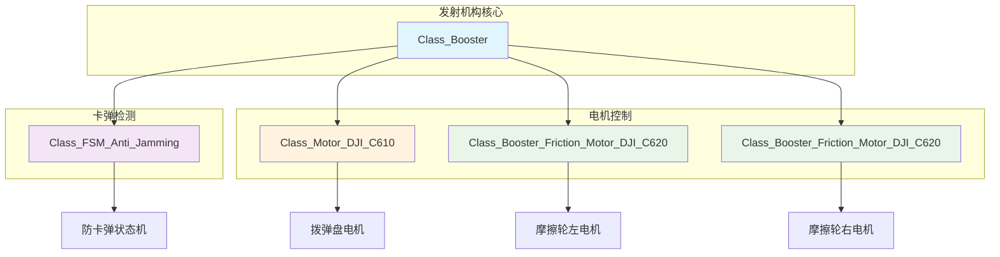
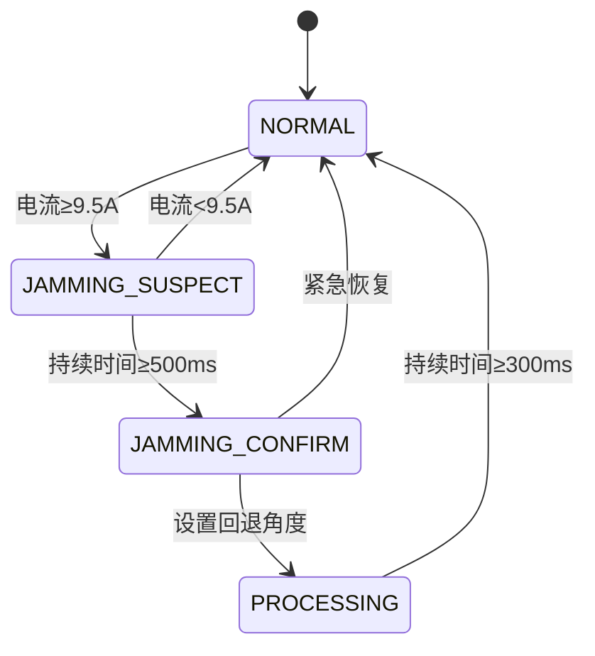
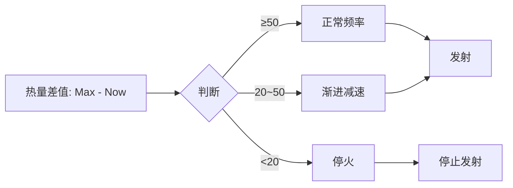

# 发射机构电控系统深度解析

## 1. 系统架构图



## 2. 头文件分析 (crt_booster.h)

### 2.1 文件概述

这是一个用于发射机构电控的驱动头文件，版本0.1于2022年8月5日创建，包含了完整的发射机构控制逻辑，包括卡弹检测和热量管理。

### 2.2 包含的头文件

```cpp
#include "3_Chariot/1_Module/Booster/Booster_Motor/crt_booster_motor.h"  // 摩擦轮电机
#include "2_Device/Motor/Motor_DJI/dvc_motor_dji.h"                      // DJI电机驱动
#include "1_Middleware/2_Algorithm/FSM/alg_fsm.h"                        // 有限状态机算法
```

### 2.3 控制类型枚举

#### 2.3.1 发射机构控制类型

```cpp
enum Enum_Booster_Control_Type
{
    Booster_Control_Type_DISABLE = 0,  // 失能状态
    Booster_Control_Type_CEASEFIRE,    // 停火状态
    Booster_Control_Type_SPOT,         // 单发状态
    Booster_Control_Type_AUTO,         // 自动状态
};
```

**作用**: 定义发射机构的不同工作模式。

#### 2.3.2 防卡弹状态类型

```cpp
enum Enum_FSM_Anti_Jamming_Status
{
    FSM_Anti_Jamming_Status_NORMAL = 0,        // 正常状态
    FSM_Anti_Jamming_Status_JAMMING_SUSPECT,   // 卡弹嫌疑状态
    FSM_Anti_Jamming_Status_JAMMING_CONFIRM,   // 卡弹确认状态
    FSM_Anti_Jamming_Status_PROCESSING,        // 处理状态
};
```

**作用**: 定义卡弹检测的状态机状态。

### 2.4 防卡弹状态机类

#### 2.4.1 类继承结构

```cpp
class Class_FSM_Anti_Jamming : public Class_FSM
```

**作用**: 继承基础状态机，实现专门的卡弹检测逻辑。

#### 2.4.2 公共成员

```cpp
public:
    Class_Booster *Booster;  // 指向发射机构主类

    void TIM_1ms_Calculate_PeriodElapsedCallback();  // 状态机计算回调
```

#### 2.4.3 保护成员变量

```cpp
protected:
    // 卡弹检测参数
    float Driver_Torque_Threshold = 9.5f;                    // 堵转扭矩阈值
    int32_t Jamming_Suspect_Time_Threshold = 500;            // 卡弹判定时间阈值
    int32_t Jamming_Solving_Time_Threshold = 300;            // 卡弹处理时间阈值
    float Driver_Back_Angle = PI / 12.0f;                    // 回退角度
```

### 2.5 发射机构主类

#### 2.5.1 核心组件

```cpp
public:
    Class_FSM_Anti_Jamming FSM_Anti_Jamming;              // 卡弹检测状态机
    Class_Motor_DJI_C610 Motor_Driver;                    // 拨弹盘电机
    Class_Booster_Friction_Motor_DJI_C620 Motor_Friction_Left;   // 左摩擦轮电机
    Class_Booster_Friction_Motor_DJI_C620 Motor_Friction_Right;  // 右摩擦轮电机
```

#### 2.5.2 初始化函数

```cpp
void Init();  // 初始化所有组件
```

#### 2.5.3 获取函数

```cpp
inline float Get_Now_Ammo_Shoot_Frequency();           // 获取当前射击频率
inline Enum_Booster_Control_Type Get_Booster_Control_Type();  // 获取控制类型
inline float Get_Friction_Omega();                    // 获取摩擦轮角速度
inline float Get_Target_Ammo_Shoot_Frequency();       // 获取目标射击频率
```

#### 2.5.4 设置函数

```cpp
inline void Set_Now_Heat(float __Now_Heat);           // 设置当前热量
inline void Set_Heat_Limit_Max(float __Heat_Limit_Max);  // 设置热量上限
inline void Set_Heat_CD(float __Heat_CD);             // 设置热量冷却速度
inline void Set_Booster_Control_Type(Enum_Booster_Control_Type __Booster_Control_Type);  // 设置控制类型
inline void Set_Friction_Omega(float __Friction_Omega);  // 设置摩擦轮角速度
inline void Set_Max_Ammo_Shoot_Frequency(float __Max_Ammo_Shoot_Frequency);  // 设置最大射击频率
```

#### 2.5.5 定时器回调函数

```cpp
void TIM_100ms_Alive_PeriodElapsedCallback();  // 100ms存活检测
void TIM_1ms_Calculate_PeriodElapsedCallback();  // 1ms控制计算
```

#### 2.5.6 内部变量

```cpp
protected:
    float Ammo_Num_Per_Round = 7.0f;  // 拨弹盘一圈子弹数

    // 热量管理参数
    float Heat_Limit_Ceasefire_Threshold = 20.0f;  // 停火热量阈值
    float Heat_Limit_Slowdown_Threshold = 50.0f;   // 减速热量阈值

    // 读变量
    float Now_Ammo_Shoot_Frequency = 16.0f;  // 当前射击频率

    // 写变量
    float Now_Heat = 0.0f;          // 当前热量
    float Heat_Limit_Max = 0.0f;    // 热量上限
    float Heat_CD = 0.0f;           // 热量冷却速度

    // 读写变量
    Enum_Booster_Control_Type Booster_Control_Type = Booster_Control_Type_CEASEFIRE;  // 控制类型
    float Friction_Omega = 700.0f;  // 摩擦轮角速度
    float Target_Ammo_Shoot_Frequency = 15.0f;  // 目标射击频率
```

## 3. 实现文件分析 (crt_booster.cpp)

### 3.1 防卡弹状态机实现

#### 3.1.1 状态机计算回调函数

```cpp
void Class_FSM_Anti_Jamming::TIM_1ms_Calculate_PeriodElapsedCallback()
{
    Status[Now_Status_Serial].Count_Time++;  // 累计时间

    switch (Now_Status_Serial)
    {
    case (FSM_Anti_Jamming_Status_NORMAL):
    {
        // 正常状态：检测扭矩是否超阈值
        if (Booster->Motor_Driver.Get_Now_Current() >= Driver_Torque_Threshold)
        {
            Set_Status(FSM_Anti_Jamming_Status_JAMMING_SUSPECT);  // 转到卡弹嫌疑状态
        }
        break;
    }
    case (FSM_Anti_Jamming_Status_JAMMING_SUSPECT):
    {
        // 卡弹嫌疑状态：检查是否持续超时
        if (Status[Now_Status_Serial].Count_Time >= Jamming_Suspect_Time_Threshold)
        {
            Set_Status(FSM_Anti_Jamming_Status_JAMMING_CONFIRM);  // 转到卡弹确认状态
        }
        else if (Booster->Motor_Driver.Get_Now_Current() < Driver_Torque_Threshold)
        {
            Set_Status(FSM_Anti_Jamming_Status_NORMAL);  // 转到正常状态
        }
        break;
    }
    case (FSM_Anti_Jamming_Status_JAMMING_CONFIRM):
    {
        // 卡弹确认状态：设置角度控制，回退一定角度
        Booster->Motor_Driver.Set_Control_Method(Motor_DJI_Control_Method_ANGLE);
        Booster->Motor_Driver.Set_Target_Angle(Booster->Motor_Driver.Get_Now_Angle() - Driver_Back_Angle);
        Set_Status(FSM_Anti_Jamming_Status_PROCESSING);  // 转到处理状态
        break;
    }
    case (FSM_Anti_Jamming_Status_PROCESSING):
    {
        // 处理状态：等待处理完成
        if (Status[Now_Status_Serial].Count_Time >= Jamming_Solving_Time_Threshold)
        {
            Set_Status(FSM_Anti_Jamming_Status_NORMAL);  // 转到正常状态
        }
        break;
    }
    }
}
```

**作用**: 实现完整的卡弹检测和处理逻辑。

### 3.2 初始化函数

#### 3.2.1 系统初始化

```cpp
void Class_Booster::Init()
{
    // 初始化防卡弹状态机
    FSM_Anti_Jamming.Booster = this;
    FSM_Anti_Jamming.Init(4, FSM_Anti_Jamming_Status_NORMAL);

    // 拨弹盘电机初始化
    Motor_Driver.PID_Angle.Init(50.0f, 0.0f, 0.0f, 0.0f, 2.0f * PI, 2.0f * PI);
    Motor_Driver.PID_Omega.Init(3.40f, 200.0f, 0.0f, 0.0f, 10.0f, 10.0f);
    Motor_Driver.Init(&hcan1, Motor_DJI_ID_0x202, Motor_DJI_Control_Method_OMEGA);

    // 摩擦轮电机左
    Motor_Friction_Left.Filter_Fourier_Omega.Init(0.0f, 0.0f, Filter_Fourier_Type_LOWPASS, 25.0f, 0.0f, 1000.0f);
    Motor_Friction_Left.PID_Omega.Init(0.15f, 0.3f, 0.002f, 0.0f, 20.0f, 20.0f);
    Motor_Friction_Left.Init(&hcan1, Motor_DJI_ID_0x204, Motor_DJI_Control_Method_OMEGA, 1.0f);

    // 摩擦轮电机右
    Motor_Friction_Right.Filter_Fourier_Omega.Init(0.0f, 0.0f, Filter_Fourier_Type_LOWPASS, 25.0f, 0.0f, 1000.0f);
    Motor_Friction_Right.PID_Omega.Init(0.15f, 0.3f, 0.002f, 0.0f, 20.0f, 20.0f);
    Motor_Friction_Right.Init(&hcan1, Motor_DJI_ID_0x203, Motor_DJI_Control_Method_OMEGA, 1.0f);
}
```

**作用**: 初始化所有电机和状态机组件。

### 3.3 主控制循环

#### 3.3.1 1ms控制回调

```cpp
void Class_Booster::TIM_1ms_Calculate_PeriodElapsedCallback()
{
    // 执行防卡弹状态机
    FSM_Anti_Jamming.TIM_1ms_Calculate_PeriodElapsedCallback();

    // 如果状态机正常，执行拨弹逻辑
    if (FSM_Anti_Jamming.Get_Now_Status_Serial() == FSM_Anti_Jamming_Status_NORMAL || 
        FSM_Anti_Jamming.Get_Now_Status_Serial() == FSM_Anti_Jamming_Status_JAMMING_SUSPECT)
    {
        Output();  // 执行输出逻辑
    }

    // 执行各电机的控制计算
    Motor_Driver.TIM_Calculate_PeriodElapsedCallback();
    Motor_Friction_Left.TIM_Calculate_PeriodElapsedCallback();
    Motor_Friction_Right.TIM_Calculate_PeriodElapsedCallback();
}
```

**作用**: 主控制循环，协调状态机和电机控制。

### 3.4 输出控制函数

#### 3.4.1 四种控制模式

```cpp
void Class_Booster::Output()
{
    switch (Booster_Control_Type)
    {
    case (Booster_Control_Type_DISABLE):  // 失能模式
    {
        Motor_Driver.Set_Control_Method(Motor_DJI_Control_Method_CURRENT);
        Motor_Friction_Left.Set_Control_Method(Motor_DJI_Control_Method_OMEGA);
        Motor_Friction_Right.Set_Control_Method(Motor_DJI_Control_Method_OMEGA);

        // 重置积分器
        Motor_Driver.PID_Angle.Set_Integral_Error(0.0f);
        Motor_Driver.PID_Omega.Set_Integral_Error(0.0f);
        Motor_Friction_Left.PID_Angle.Set_Integral_Error(0.0f);
        Motor_Friction_Right.PID_Angle.Set_Integral_Error(0.0f);

        // 设置零输出
        Motor_Driver.Set_Target_Current(0.0f);
        Motor_Friction_Left.Set_Target_Omega(0.0f);
        Motor_Friction_Right.Set_Target_Omega(0.0f);
        break;
    }
    case (Booster_Control_Type_CEASEFIRE):  // 停火模式
    {
        Now_Ammo_Shoot_Frequency = 0.0f;
        if (Motor_Driver.Get_Control_Method() == Motor_DJI_Control_Method_ANGLE)
        {
            // 角度控制模式处理
        }
        else if (Motor_Driver.Get_Control_Method() == Motor_DJI_Control_Method_OMEGA)
        {
            Motor_Driver.Set_Target_Omega(0.0f);  // 停止拨弹盘
        }
        // 摩擦轮保持运转
        Motor_Friction_Left.Set_Target_Omega(Friction_Omega);
        Motor_Friction_Right.Set_Target_Omega(-Friction_Omega);
        break;
    }
    case (Booster_Control_Type_SPOT):  // 单发模式
    {
        Motor_Driver.Set_Control_Method(Motor_DJI_Control_Method_ANGLE);
        Motor_Friction_Left.Set_Control_Method(Motor_DJI_Control_Method_OMEGA);
        Motor_Friction_Right.Set_Control_Method(Motor_DJI_Control_Method_OMEGA);

        // 拨弹盘转动1/7圈（一圈7颗子弹）
        Motor_Driver.Set_Target_Angle(Motor_Driver.Get_Now_Angle() + 2.0f * PI / 7.0f);
        Motor_Friction_Left.Set_Target_Omega(Friction_Omega);
        Motor_Friction_Right.Set_Target_Omega(-Friction_Omega);

        // 单发完成后立即回到停火状态
        Booster_Control_Type = Booster_Control_Type_CEASEFIRE;
        break;
    }
    case (Booster_Control_Type_AUTO):  // 自动模式
    {
        // 热量控制逻辑
        float tmp_delta = Heat_Limit_Max - Now_Heat;
        if (tmp_delta >= Heat_Limit_Slowdown_Threshold)
        {
            Now_Ammo_Shoot_Frequency = Target_Ammo_Shoot_Frequency;  // 正常频率
        }
        else if (tmp_delta >= Heat_Limit_Ceasefire_Threshold && tmp_delta < Heat_Limit_Slowdown_Threshold)
        {
            // 渐进式减速
            Now_Ammo_Shoot_Frequency = (Target_Ammo_Shoot_Frequency * (Heat_Limit_Ceasefire_Threshold - tmp_delta) + 
                                       Heat_CD / 10.0f * (tmp_delta - Heat_Limit_Slowdown_Threshold)) / 
                                      (Heat_Limit_Ceasefire_Threshold - Heat_Limit_Slowdown_Threshold);
        }
        else if (tmp_delta < Heat_Limit_Ceasefire_Threshold)
        {
            Now_Ammo_Shoot_Frequency = 0.0f;  // 停火
        }

        Motor_Driver.Set_Control_Method(Motor_DJI_Control_Method_OMEGA);
        Motor_Friction_Left.Set_Control_Method(Motor_DJI_Control_Method_OMEGA);
        Motor_Friction_Right.Set_Control_Method(Motor_DJI_Control_Method_OMEGA);

        // 设置拨弹盘转速
        Motor_Driver.Set_Target_Omega(Now_Ammo_Shoot_Frequency * 2.0f * PI / Ammo_Num_Per_Round);
        Motor_Friction_Left.Set_Target_Omega(Friction_Omega);
        Motor_Friction_Right.Set_Target_Omega(-Friction_Omega);
        break;
    }
    }
}
```

**作用**: 根据当前控制模式执行相应的输出逻辑。

## 4. 状态机状态转换图



## 5. 热量管理策略



## 6. 关键特性分析

### 6.1 防卡弹机制

- **扭矩检测**: 通过电流判断是否堵转
- **时间阈值**: 防止误判
- **自动处理**: 自动回退角度解除卡弹

### 6.2 热量管理

- **三层保护**: 停火、减速、正常
- **渐进控制**: 平滑的频率调节
- **实时监控**: 动态调整发射频率

### 6.3 多模式控制

- **失能模式**: 完全停止
- **停火模式**: 仅摩擦轮运转
- **单发模式**: 精确单发
- **自动模式**: 持续射击

## 7. 类的作用域和外设资源

### 7.1 作用域

- **公共作用域(public)**: 提供完整的控制接口和状态查询
- **保护作用域(protected)**: 内部控制逻辑和参数管理

### 7.2 使用的外设资源

- **CAN接口**: 与DJI电机通信（C610, C620）
- **定时器**: 1ms控制周期，100ms存活检测
- **内存资源**: PID参数、状态机状态、滤波器状态
- **算法库**: 有限状态机、PID控制器、滤波器

### 7.3 工作流程

1. 初始化所有电机和状态机
2. 1ms控制循环：状态机检测→输出控制→电机计算
3. 100ms存活检测：确保电机在线
4. 根据控制模式执行相应逻辑

这个发射机构电控系统实现了完整的自动化射击功能，包括智能卡弹检测、热量管理和多种射击模式，是一个功能完善的机器人武器系统控制方案。