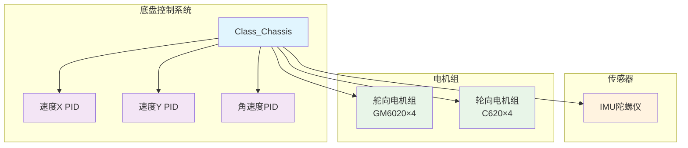
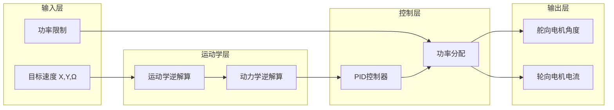
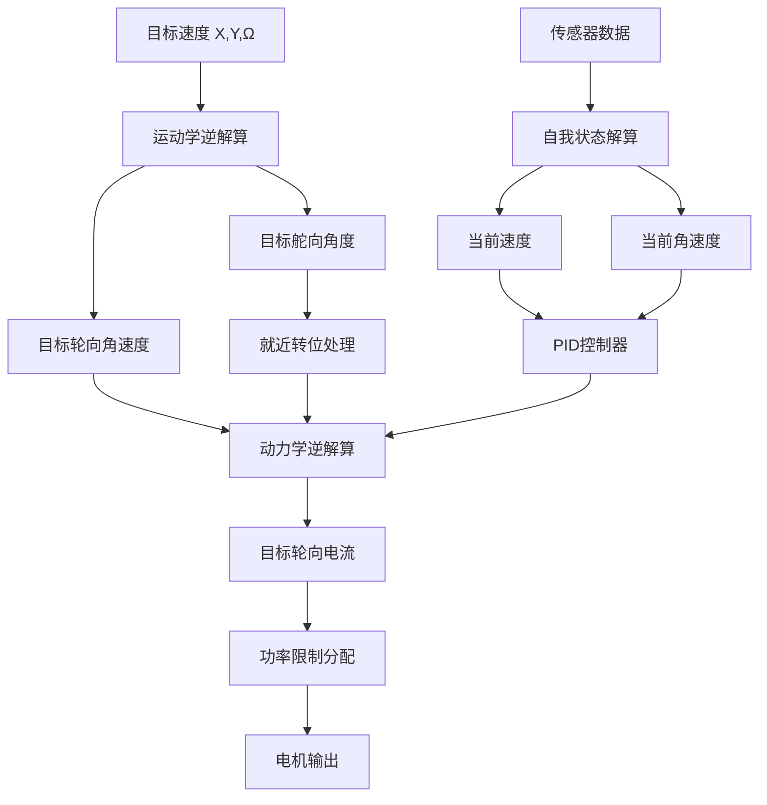

# 四轮舵轮底盘电控系统深度解析

## 1. 系统架构图



## 2. 系统结构图



## 3. 头文件分析 (crt_chassis.h)

### 3.1 文件概述

这是一个用于四轮舵轮底盘的电控驱动头文件，版本1.2于2024年1月17日更新，新增了速度规划算法并解耦合了各个算法模块。

### 3.2 包含的头文件

```cpp
#include "2_Device/AHRS/AHRS_WHEELTEC/dvc_ahrs_wheeltec.h"  // IMU陀螺仪
#include "2_Device/Motor/Motor_DJI/dvc_motor_dji.h"         // DJI电机驱动
#include "2_Device/Referee/dvc_referee.h"                   // 裁判系统
#include "1_Middleware/2_Algorithm/Slope/alg_slope.h"       // 斜坡算法
```

### 3.3 控制类型枚举

```cpp
enum Enum_Chassis_Control_Type
{
    Chassis_Control_Type_DISABLE = 0,  // 失能状态
    Chassis_Control_Type_NORMAL,       // 正常状态
};
```

**作用**: 定义底盘的控制模式。

### 3.4 底盘主类定义

#### 3.4.1 核心组件

```cpp
public:
    // PID控制器组
    Class_PID PID_Velocity_X;    // X轴速度PID
    Class_PID PID_Velocity_Y;    // Y轴速度PID
    Class_PID PID_Omega;         // 角速度PID

    // 传感器
    Class_AHRS_WHEELTEC *AHRS_Chassis;  // IMU陀螺仪

    // 电机组
    Class_Motor_DJI_GM6020 Motor_Steer[4];  // 舵向电机数组
    Class_Motor_DJI_C620 Motor_Wheel[4];    // 轮向电机数组
```

#### 3.4.2 初始化函数

```cpp
void Init();  // 系统初始化
```

#### 3.4.3 获取函数

```cpp
// 功率相关
inline float Get_Now_Motor_Power();           // 获取总功率
inline float Get_Now_Steer_Motor_Power();    // 获取舵向功率
inline float Get_Now_Wheel_Motor_Power();    // 获取轮向功率

// 状态相关
inline float Get_Now_Velocity_X();           // 获取X轴速度
inline float Get_Now_Velocity_Y();           // 获取Y轴速度
inline float Get_Now_Omega();               // 获取角速度
inline float Get_Now_AHRS_Omega();          // 获取陀螺仪角速度
inline float Get_Angle_Pitch();             // 获取俯仰角
inline float Get_Angle_Roll();              // 获取横滚角

// 目标相关
inline float Get_Target_Velocity_X();       // 获取目标X速度
inline float Get_Target_Velocity_Y();       // 获取目标Y速度
inline float Get_Target_Omega();            // 获取目标角速度
```

#### 3.4.4 设置函数

```cpp
inline void Set_Power_Limit_Max(float __Power_Limit_Max);           // 设置功率限制
inline void Set_Chassis_Control_Type(Enum_Chassis_Control_Type __Chassis_Control_Type);  // 设置控制类型
inline void Set_Target_Velocity_X(float __Target_Velocity_X);       // 设置目标X速度
inline void Set_Target_Velocity_Y(float __Target_Velocity_Y);       // 设置目标Y速度
inline void Set_Target_Omega(float __Target_Omega);                // 设置目标角速度
```

#### 3.4.5 定时器回调函数

```cpp
void TIM_100ms_Alive_PeriodElapsedCallback();  // 100ms存活检测
void TIM_2ms_Resolution_PeriodElapsedCallback();  // 2ms解算
void TIM_2ms_Control_PeriodElapsedCallback();    // 2ms控制
```

#### 3.4.6 内部常量

```cpp
const float Wheel_Radius = 0.058f;  // 轮子半径
const float Wheel_To_Core_Distance[4] = {0.207f, 0.207f, 0.207f, 0.207f};  // 轮心距离
const float Wheel_Azimuth[4] = {PI/4.0f, 3*PI/4.0f, 5*PI/4.0f, 7*PI/4.0f};  // 轮子方位角
```

#### 3.4.7 内部变量

```cpp
protected:
    // 目标值数组
    float Target_Steer_Angle[4];     // 目标舵向角度
    float Target_Wheel_Omega[4];     // 目标轮向角速度
    float Target_Wheel_Current[4];   // 目标轮向电流

    // 摩擦力参数
    float Static_Resistance_Wheel_Current[4];    // 静摩擦力
    float Dynamic_Resistance_Wheel_Current[4];   // 动摩擦力
    float Wheel_Resistance_Omega_Threshold = 1.0f;  // 摩擦力阈值

    // 状态变量
    float Now_Motor_Power;           // 当前总功率
    float Now_Velocity_X, Now_Velocity_Y;  // 当前速度
    float Now_Omega;                 // 当前角速度
    float Power_Limit_Max = 45.0f;   // 功率限制上限
```

## 4. 实现文件分析 (crt_chassis.cpp)

### 4.1 初始化函数

#### 4.1.1 系统初始化

```cpp
void Class_Chassis::Init()
{
    // PID初始化
    PID_Velocity_X.Init(600.0f, 0.0f, 0.0f, 0.0f, 150.0f, 3000.0f, 0.002f);  // X轴速度PID
    PID_Velocity_Y.Init(600.0f, 0.0f, 0.0f, 0.0f, 150.0f, 3000.0f, 0.002f);  // Y轴速度PID
    PID_Omega.Init(25.0f, 0.0f, 0.0f, 0.0f, 10.0f, 400.0f, 0.002f);         // 角速度PID

    // 舵向电机初始化（4个）
    for(int i = 0; i < 4; i++) {
        Motor_Steer[i].PID_Angle.Init(...);  // 角度PID
        Motor_Steer[i].PID_Omega.Init(...);  // 速度PID
        Motor_Steer[i].Init(&hcan2, Motor_DJI_ID_0x207+i, ...);  // 电机初始化
    }

    // 轮向电机初始化（4个）
    for(int i = 0; i < 4; i++) {
        Motor_Wheel[i].Init(&hcan2, Motor_DJI_ID_0x201+i, ...);  // 电流控制模式
    }
}
```

**作用**: 初始化所有PID控制器和16个电机（8个舵向+8个轮向）。

### 4.2 主控制循环

#### 4.2.1 解算循环（2ms）

```cpp
void Class_Chassis::TIM_2ms_Resolution_PeriodElapsedCallback()
{
    Self_Resolution();  // 自我状态解算
}
```

#### 4.2.2 控制循环（2ms）

```cpp
void Class_Chassis::TIM_2ms_Control_PeriodElapsedCallback()
{
    Kinematics_Inverse_Resolution();  // 运动学逆解算
    Output_To_Dynamics();            // 输出到动力学
    Dynamics_Inverse_Resolution();   // 动力学逆解算
    Output_To_Motor();               // 输出到电机
}
```

### 4.3 核心算法函数

#### 4.3.1 自我状态解算

```cpp
void Class_Chassis::Self_Resolution()
{
    // 根据电机编码器与陀螺仪计算速度和角度
    Now_Velocity_X = 0.0f;
    Now_Velocity_Y = 0.0f;
    Now_Omega = 0.0f;

    // 通过轮速计计算整体速度
    for (int i = 0; i < 4; i++)
    {
        // X轴速度：轮子角速度 × cos(舵向角) × 半径
        Now_Velocity_X += (Motor_Wheel[i].Get_Now_Omega() * arm_cos_f32(Motor_Steer[i].Get_Now_Angle()) * Wheel_Radius) / 4.0f;
        // Y轴速度：轮子角速度 × sin(舵向角) × 半径
        Now_Velocity_Y += (Motor_Wheel[i].Get_Now_Omega() * arm_sin_f32(Motor_Steer[i].Get_Now_Angle()) * Wheel_Radius) / 4.0f;
        // 角速度：轮子角速度 × sin(舵向角-方位角) × 半径/距离
        Now_Omega += (Motor_Wheel[i].Get_Now_Omega() * arm_sin_f32(Motor_Steer[i].Get_Now_Angle() - Wheel_Azimuth[i]) * Wheel_Radius / Wheel_To_Core_Distance[i]) / 4.0f;
    }

    // 角度解算（陀螺仪数据）
    float pitch = -AHRS_Chassis->Get_Angle_Pitch();
    float roll = AHRS_Chassis->Get_Angle_Roll();
    
    // 斜坡法向量计算
    Slope_Direction_X = arm_sin_f32(pitch) * arm_cos_f32(roll);
    Slope_Direction_Y = -arm_sin_f32(roll);
    Slope_Direction_Z = arm_cos_f32(pitch) * arm_cos_f32(roll);

    // 功率计算
    Now_Motor_Power = Now_Steer_Motor_Power = Now_Wheel_Motor_Power = 0.0f;
    for (int i = 0; i < 4; i++)
    {
        Now_Motor_Power += Motor_Steer[i].Get_Now_Power() + Motor_Wheel[i].Get_Now_Power();
        Now_Steer_Motor_Power += Motor_Steer[i].Get_Now_Power();
        Now_Wheel_Motor_Power += Motor_Wheel[i].Get_Now_Power();
    }
}
```

**作用**: 通过轮速计和陀螺仪实时计算底盘的速度、角度和功率状态。

#### 4.3.2 运动学逆解算

```cpp
void Class_Chassis::Kinematics_Inverse_Resolution()
{
    for (int i = 0; i < 4; i++)
    {
        float tmp_velocity_x, tmp_velocity_y, tmp_velocity_modulus;

        // 解算每个轮组的目标线速度
        tmp_velocity_x = Target_Velocity_X - Target_Omega * Wheel_To_Core_Distance[i] * arm_sin_f32(Wheel_Azimuth[i]);  // X分量
        tmp_velocity_y = Target_Velocity_Y + Target_Omega * Wheel_To_Core_Distance[i] * arm_cos_f32(Wheel_Azimuth[i]); // Y分量
        
        arm_sqrt_f32(tmp_velocity_x * tmp_velocity_x + tmp_velocity_y * tmp_velocity_y, &tmp_velocity_modulus);  // 模长

        // 目标轮向角速度 = 线速度模长 / 轮子半径
        Target_Wheel_Omega[i] = tmp_velocity_modulus / Wheel_Radius;

        // 目标舵向角度 = atan2(Y分量, X分量)
        if (tmp_velocity_modulus == 0.0f)
        {
            Target_Steer_Angle[i] = Motor_Steer[i].Get_Now_Angle();  // 零速度时保持当前角度
        }
        else
        {
            Target_Steer_Angle[i] = atan2f(tmp_velocity_y, tmp_velocity_x);
        }
    }

    _Steer_Motor_Kinematics_Nearest_Transposition();  // 就近转位处理
}
```

**作用**: 将全局目标速度分解为每个轮组的目标舵向角度和轮向角速度。

#### 4.3.3 就近转位处理

```cpp
void Class_Chassis::_Steer_Motor_Kinematics_Nearest_Transposition()
{
    for (int i = 0; i < 4; i++)
    {
        // 计算角度差值并归一化到[-π, π]
        float tmp_delta_angle = Math_Modulus_Normalization(Target_Steer_Angle[i] - Motor_Steer[i].Get_Now_Angle(), 2.0f * PI);

        if (-PI / 2.0f <= tmp_delta_angle && tmp_delta_angle <= PI / 2.0f)
        {
            // ±π/2范围内无需反转，直接赋值
            Target_Steer_Angle[i] = tmp_delta_angle + Motor_Steer[i].Get_Now_Angle();
        }
        else
        {
            // 需要反转的情况：角度翻转π，轮子反向
            Target_Steer_Angle[i] = Math_Modulus_Normalization(tmp_delta_angle + PI, 2.0f * PI) + Motor_Steer[i].Get_Now_Angle();
            Target_Wheel_Omega[i] *= -1.0f;  // 轮子反向旋转
        }
    }
}
```

**作用**: 优化舵向电机转向路径，选择最短路径到达目标角度。

#### 4.3.4 动力学逆解算

```cpp
void Class_Chassis::Dynamics_Inverse_Resolution()
{
    float force_x, force_y, torque_omega;

    // 从PID获取目标力和扭矩
    force_x = PID_Velocity_X.Get_Out();
    force_y = PID_Velocity_Y.Get_Out();
    torque_omega = PID_Omega.Get_Out();

    // 每个轮子的摩擦力计算
    float tmp_force[4];
    for (int i = 0; i < 4; i++)
    {
        tmp_force[i] = force_x * arm_cos_f32(Motor_Steer[i].Get_Now_Angle()) + 
                       force_y * arm_sin_f32(Motor_Steer[i].Get_Now_Angle()) - 
                       torque_omega / Wheel_To_Core_Distance[i] * arm_sin_f32(Wheel_Azimuth[i] - Motor_Steer[i].Get_Now_Angle());
    }

    for (int i = 0; i < 4; i++)
    {
        // 摩擦力转换为轮子电流
        Target_Wheel_Current[i] = tmp_force[i] * Wheel_Radius + 
                                Wheel_Speed_Limit_Factor * (Target_Wheel_Omega[i] - Motor_Wheel[i].Get_Now_Omega());

        // 摩擦力补偿
        if (abs(Target_Wheel_Omega[i]) > Wheel_Resistance_Omega_Threshold)
        {
            // 高速时添加动摩擦力补偿
            Target_Wheel_Current[i] += sign(Target_Wheel_Omega[i]) * Dynamic_Resistance_Wheel_Current[i];
        }
        else
        {
            // 低速时线性插值
            Target_Wheel_Current[i] += Motor_Wheel[i].Get_Now_Omega() / Wheel_Resistance_Omega_Threshold * Dynamic_Resistance_Wheel_Current[i];
        }
    }
}
```

**作用**: 将目标力和扭矩转换为每个轮子所需的驱动力。

#### 4.3.5 功率限制控制

```cpp
void Class_Chassis::_Power_Limit_Control()
{
    float available_power = Power_Limit_Max;  // 可用功率
    float consume_power = 0.0f;              // 消耗功率
    float steer_consume_power = 0.0f;        // 舵向消耗功率
    float wheel_consume_power = 0.0f;        // 轮向消耗功率
    float steer_power_single[4], wheel_power_single[4];

    // 计算各电机功率
    for (int i = 0; i < 4; i++)
    {
        steer_power_single[i] = Motor_Steer[i].Get_Power_Estimate();
        wheel_power_single[i] = Motor_Wheel[i].Get_Power_Estimate();

        if (steer_power_single[i] > 0)
        {
            consume_power += steer_power_single[i];
            steer_consume_power += steer_power_single[i];
        }
        else
        {
            available_power += -steer_power_single[i];  // 回收负功率
        }

        if (wheel_power_single[i] > 0)
        {
            consume_power += wheel_power_single[i];
            wheel_consume_power += wheel_power_single[i];
        }
        else
        {
            available_power += -wheel_power_single[i];  // 回收负功率
        }
    }

    // 舵向电机功率控制（分配60%可用功率）
    Steer_Factor = __Steer_Power_Limit_Control(available_power * 0.6f, steer_consume_power);
    for (int i = 0; i < 4; i++)
    {
        if (steer_power_single[i] > 0)
        {
            Motor_Steer[i].Set_Power_Factor(Steer_Factor);
        }
        else
        {
            Motor_Steer[i].Set_Power_Factor(1.0f);
        }
    }

    // 轮向电机功率控制（剩余功率）
    Wheel_Factor = __Wheel_Power_Limit_Control(available_power - Now_Steer_Motor_Power, wheel_consume_power);
    for (int i = 0; i < 4; i++)
    {
        if (wheel_power_single[i] > 0)
        {
            Motor_Wheel[i].Set_Power_Factor(Wheel_Factor);
        }
        else
        {
            Motor_Wheel[i].Set_Power_Factor(1.0f);
        }
    }
}
```

**作用**: 在功率限制下智能分配功率给舵向和轮向电机。

## 5. 算法流程图



## 6. 关键特性分析

### 6.1 运动学特性

- **全向移动**: 4个舵轮可实现任意方向移动
- **原地旋转**: 可独立控制角速度
- **就近转位**: 优化舵向电机转向路径

### 6.2 动力学特性

- **力矩平衡**: 考虑轮组位置影响
- **摩擦力补偿**: 静摩擦和动摩擦补偿
- **功率优化**: 智能功率分配

### 6.3 控制特性

- **双层控制**: 位置控制和力控制结合
- **实时解算**: 2ms控制周期
- **安全保护**: 功率限制和状态监控

## 7. 类的作用域和外设资源

### 7.1 作用域

- **公共作用域(public)**: 提供完整的控制接口和状态查询
- **保护作用域(protected)**: 内部算法逻辑和参数管理

### 7.2 使用的外设资源

- **CAN接口**: 与16个DJI电机通信（GM6020×4, C620×4）
- **IMU陀螺仪**: WHEELETEC AHRS获取姿态数据
- **定时器**: 2ms控制周期，100ms存活检测
- **内存资源**: PID参数、电机状态、算法中间变量
- **数学库**: 三角函数、平方根等运算

### 7.3 工作流程

1. **初始化**: 配置所有PID和电机参数
2. **状态解算**: 2ms周期计算当前状态
3. **控制计算**: 2ms周期执行运动学和动力学算法
4. **功率分配**: 智能分配功率限制
5. **电机输出**: 控制舵向和轮向电机

这个四轮舵轮底盘电控系统实现了复杂的全向移动控制，通过精密的运动学和动力学算法，以及智能的功率管理，实现了高性能的机器人底盘控制。