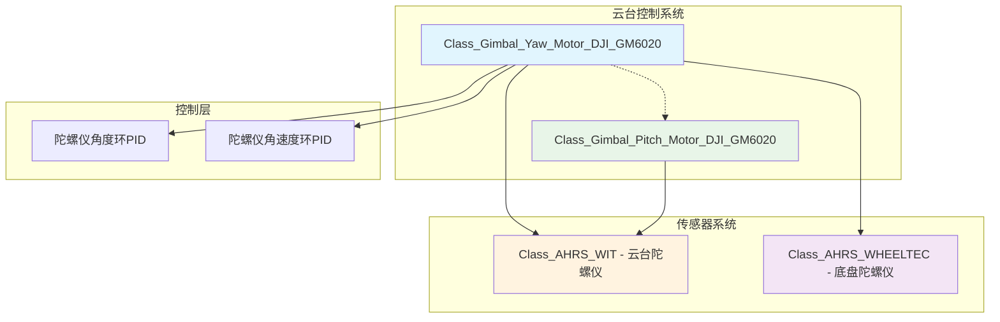
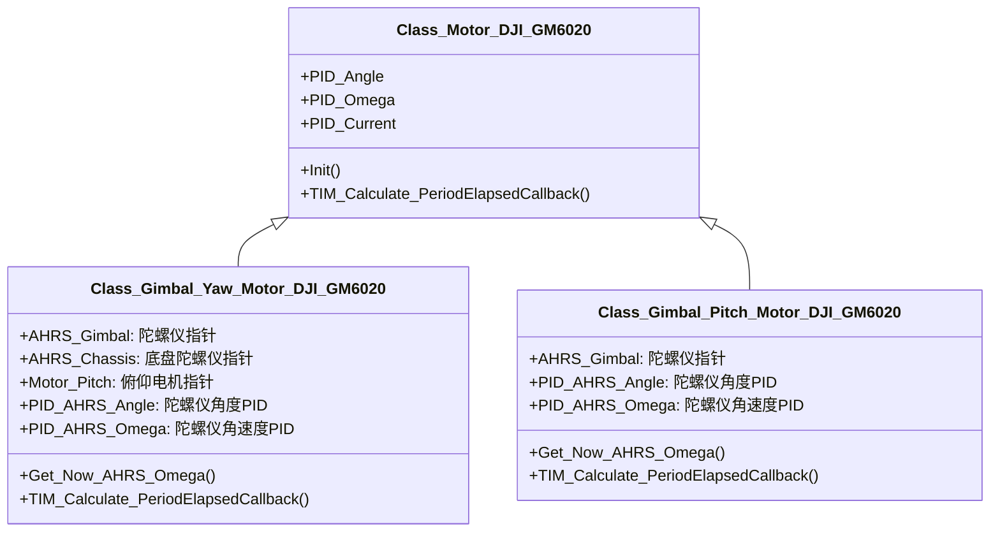
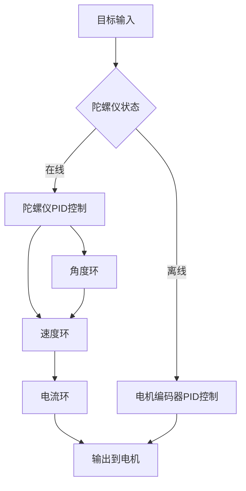

# 云台电机控制系统深度解析

## 1. 系统架构图



## 2. 类继承关系图



## 3. 头文件分析 (crt_gimbal_motor.h)

### 3.1 文件概述

这是一个用于云台电机的特殊化驱动头文件，版本0.1于2024年1月30日新增，提供了基于陀螺仪的高精度云台控制。

### 3.2 包含的头文件

```cpp
#include "2_Device/AHRS/AHRS_WHEELTEC/dvc_ahrs_wheeltec.h"  // 底盘陀螺仪
#include "2_Device/AHRS/AHRS_WIT/dvc_ahrs_wit.h"           // 云台陀螺仪
#include "2_Device/Motor/Motor_DJI/dvc_motor_dji.h"        // DJI电机驱动
#include "1_Middleware/2_Algorithm/Filter/alg_filter.h"    // 滤波算法
```

### 3.3 Yaw轴电机类

#### 3.3.1 类继承结构

```cpp
class Class_Gimbal_Yaw_Motor_DJI_GM6020 : public Class_Motor_DJI_GM6020
```

**作用**: 继承DJI GM6020电机的所有功能，并扩展陀螺仪控制。

#### 3.3.2 传感器指针

```cpp
public:
    Class_AHRS_WIT *AHRS_Gimbal;         // 云台陀螺仪指针
    Class_AHRS_WHEELTEC *AHRS_Chassis;  // 底盘陀螺仪指针
    Class_Gimbal_Pitch_Motor_DJI_GM6020 *Motor_Pitch;  // 俯仰电机指针
```

#### 3.3.3 陀螺仪PID控制器

```cpp
public:
    Class_PID PID_AHRS_Angle;   // 陀螺仪角度环PID
    Class_PID PID_AHRS_Omega;   // 陀螺仪角速度环PID
```

#### 3.3.4 公共接口

```cpp
inline float Get_Now_AHRS_Omega();  // 获取陀螺仪角速度
void TIM_100ms_Alive_PeriodElapsedCallback();  // 存活检测
void TIM_Calculate_PeriodElapsedCallback();    // 计算回调
```

### 3.4 Pitch轴电机类

#### 3.4.1 类继承结构

```cpp
class Class_Gimbal_Pitch_Motor_DJI_GM6020 : public Class_Motor_DJI_GM6020
```

**作用**: 继承DJI GM6020电机的所有功能，并扩展陀螺仪控制。

#### 3.4.2 传感器指针

```cpp
public:
    Class_AHRS_WIT *AHRS_Gimbal;  // 云台陀螺仪指针
```

#### 3.4.3 陀螺仪PID控制器

```cpp
public:
    Class_PID PID_AHRS_Angle;   // 陀螺仪角度环PID
    Class_PID PID_AHRS_Omega;   // 陀螺仪角速度环PID
```

#### 3.4.4 公共接口

```cpp
inline float Get_Now_AHRS_Omega();  // 获取陀螺仪角速度
void TIM_100ms_Alive_PeriodElapsedCallback();  // 存活检测
void TIM_Calculate_PeriodElapsedCallback();    // 计算回调
```

### 3.5 内联函数实现

#### 3.5.1 Yaw轴陀螺仪角速度获取

```cpp
inline float Class_Gimbal_Yaw_Motor_DJI_GM6020::Get_Now_AHRS_Omega()
{
    if (AHRS_Gimbal->Get_Status() == AHRS_WIT_Status_ENABLE && AHRS_Chassis->Get_Status() == AHRS_WHEELTEC_Status_ENABLE)
    {
        // 陀螺仪在线时的复合角速度计算
        return (AHRS_Gimbal->Get_Omega_Z() * arm_cos_f32(-Motor_Pitch->Get_Now_Angle()) - 
                AHRS_Gimbal->Get_Omega_X() * arm_sin_f32(-Motor_Pitch->Get_Now_Angle()) + 
                AHRS_Chassis->Get_Omega_Z());
    }
    else
    {
        // 陀螺仪离线时使用电机编码器数据
        return (Rx_Data.Now_Omega);
    }
}
```

**作用**: 计算Yaw轴的真实角速度，考虑俯仰角的影响。

#### 3.5.2 Pitch轴陀螺仪角速度获取

```cpp
inline float Class_Gimbal_Pitch_Motor_DJI_GM6020::Get_Now_AHRS_Omega()
{
    if (AHRS_Gimbal->Get_Status() == AHRS_WIT_Status_ENABLE)
    {
        // 使用陀螺仪Y轴角速度
        return (-AHRS_Gimbal->Get_Omega_Y());
    }
    else
    {
        // 陀螺仪离线时使用电机编码器数据
        return (Rx_Data.Now_Omega);
    }
}
```

**作用**: 获取Pitch轴的陀螺仪角速度。

## 4. 实现文件分析 (crt_gimbal_motor.cpp)

### 4.1 Yaw轴电机实现

#### 4.1.1 存活检测函数

```cpp
void Class_Gimbal_Yaw_Motor_DJI_GM6020::TIM_100ms_Alive_PeriodElapsedCallback()
{
    if (Flag == Pre_Flag)
    {
        // 电机断开连接：重置所有PID积分器
        Motor_DJI_Status = Motor_DJI_Status_DISABLE;
        PID_Angle.Set_Integral_Error(0.0f);
        PID_Omega.Set_Integral_Error(0.0f);
        PID_Current.Set_Integral_Error(0.0f);
        PID_AHRS_Angle.Set_Integral_Error(0.0f);
        PID_AHRS_Omega.Set_Integral_Error(0.0f);
    }
    else
    {
        // 电机保持连接
        Motor_DJI_Status = Motor_DJI_Status_ENABLE;
    }
    Pre_Flag = Flag;
}
```

**作用**: 检测电机是否在线，离线时重置PID积分器防止积分饱和。

#### 4.1.2 主控制计算函数

```cpp
void Class_Gimbal_Yaw_Motor_DJI_GM6020::TIM_Calculate_PeriodElapsedCallback()
{
    PID_Calculate();  // 执行PID计算

    // 根据驱动器版本输出控制信号
    if (Driver_Version == Motor_DJI_GM6020_Driver_Version_DEFAULT)
    {
        float tmp_value = Target_Voltage + Feedforward_Voltage;
        Math_Constrain(&tmp_value, -Voltage_Max, Voltage_Max);
        Out = tmp_value * Voltage_To_Out;
    }
    else if (Driver_Version == Motor_DJI_GM6020_Driver_Version_2023)
    {
        float tmp_value = Target_Current + Feedforward_Current;
        Math_Constrain(&tmp_value, -Current_Max, Current_Max);
        Out = tmp_value * Current_To_Out;
    }

    Output();  // 输出到电机

    // 功率限制时重置前馈值
    if (Power_Limit_Status == Motor_DJI_Power_Limit_Status_DISABLE)
    {
        Feedforward_Voltage = 0.0f;
        Feedforward_Current = 0.0f;
        Feedforward_Omega = 0.0f;
    }
}
```

**作用**: 主控制循环，计算PID、约束输出并发送到电机。

#### 4.1.3 PID计算函数（核心）

```cpp
void Class_Gimbal_Yaw_Motor_DJI_GM6020::PID_Calculate()
{
    if (AHRS_Gimbal->Get_Status() == AHRS_WIT_Status_ENABLE && 
        AHRS_Chassis->Get_Status() == AHRS_WHEELTEC_Status_ENABLE)
    {
        // 陀螺仪在线：使用陀螺仪数据进行反馈控制
        switch (Motor_DJI_Control_Method)
        {
        case (Motor_DJI_Control_Method_OMEGA):  // 速度控制模式
        {
            if (Driver_Version == Motor_DJI_GM6020_Driver_Version_DEFAULT)
            {
                // 设置陀螺仪角速度目标
                PID_AHRS_Omega.Set_Target(Target_Omega + Feedforward_Omega);
                
                // 计算复合角速度（考虑俯仰角影响）
                PID_AHRS_Omega.Set_Now(AHRS_Gimbal->Get_Omega_Z() * arm_cos_f32(-Motor_Pitch->Get_Now_Angle()) - 
                                        AHRS_Gimbal->Get_Omega_X() * arm_sin_f32(-Motor_Pitch->Get_Now_Angle()) + 
                                        AHRS_Chassis->Get_Omega_Z());
                
                PID_AHRS_Omega.TIM_Calculate_PeriodElapsedCallback();
                Target_Current = PID_AHRS_Omega.Get_Out();

                // 电流环控制
                PID_Current.Set_Target(Target_Current + Feedforward_Current);
                PID_Current.Set_Now(Rx_Data.Now_Current);
                PID_Current.TIM_Calculate_PeriodElapsedCallback();
                Target_Voltage = PID_Current.Get_Out();
            }
            else if (Driver_Version == Motor_DJI_GM6020_Driver_Version_2023)
            {
                PID_AHRS_Omega.Set_Target(Target_Omega + Feedforward_Omega);
                PID_AHRS_Omega.Set_Now(AHRS_Gimbal->Get_Omega_Z() * arm_cos_f32(-Motor_Pitch->Get_Now_Angle()) - 
                                        AHRS_Gimbal->Get_Omega_X() * arm_sin_f32(-Motor_Pitch->Get_Now_Angle()) + 
                                        AHRS_Chassis->Get_Omega_Z());
                PID_AHRS_Omega.TIM_Calculate_PeriodElapsedCallback();
                Target_Current = PID_AHRS_Omega.Get_Out();
            }
            break;
        }
        case (Motor_DJI_Control_Method_ANGLE):  // 角度控制模式
        {
            if (Driver_Version == Motor_DJI_GM6020_Driver_Version_DEFAULT)
            {
                // 角度环：目标角度 → 目标速度
                PID_AHRS_Angle.Set_Target(Target_Angle);
                PID_AHRS_Angle.Set_Now(Rx_Data.Now_Angle);
                PID_AHRS_Angle.TIM_Calculate_PeriodElapsedCallback();
                Target_Omega = PID_AHRS_Angle.Get_Out();

                // 速度环：目标速度 → 目标电流
                PID_AHRS_Omega.Set_Target(Target_Omega + Feedforward_Omega);
                PID_AHRS_Omega.Set_Now(AHRS_Gimbal->Get_Omega_Z() * arm_cos_f32(-Motor_Pitch->Get_Now_Angle()) - 
                                        AHRS_Gimbal->Get_Omega_X() * arm_sin_f32(-Motor_Pitch->Get_Now_Angle()) + 
                                        AHRS_Chassis->Get_Omega_Z());
                PID_AHRS_Omega.TIM_Calculate_PeriodElapsedCallback();
                Target_Current = PID_AHRS_Omega.Get_Out();

                // 电流环：目标电流 → 电压输出
                PID_Current.Set_Target(Target_Current + Feedforward_Current);
                PID_Current.Set_Now(Rx_Data.Now_Current);
                PID_Current.TIM_Calculate_PeriodElapsedCallback();
                Target_Voltage = PID_Current.Get_Out();
            }
            // 2023版本类似处理...
            break;
        }
        // 其他控制模式处理...
        }
    }
    else
    {
        // 陀螺仪离线：使用电机编码器数据进行反馈控制
        // 与陀螺仪在线时类似，但使用Rx_Data.Now_Omega等电机数据
    }
}
```

**作用**: 根据陀螺仪状态选择不同的控制策略，实现高精度云台控制。

### 4.2 Pitch轴电机实现

#### 4.2.1 PID计算函数

```cpp
void Class_Gimbal_Pitch_Motor_DJI_GM6020::PID_Calculate()
{
    if (AHRS_Gimbal->Get_Status() == AHRS_WIT_Status_ENABLE)
    {
        // 陀螺仪在线：使用陀螺仪Y轴数据
        switch (Motor_DJI_Control_Method)
        {
        case (Motor_DJI_Control_Method_OMEGA):
        {
            PID_AHRS_Omega.Set_Target(Target_Omega + Feedforward_Omega);
            PID_AHRS_Omega.Set_Now(-AHRS_Gimbal->Get_Omega_Y());  // 注意负号
            PID_AHRS_Omega.TIM_Calculate_PeriodElapsedCallback();
            Target_Current = PID_AHRS_Omega.Get_Out();
            break;
        }
        case (Motor_DJI_Control_Method_ANGLE):
        {
            PID_AHRS_Angle.Set_Target(Target_Angle);
            PID_AHRS_Angle.Set_Now(Rx_Data.Now_Angle);
            PID_AHRS_Angle.TIM_Calculate_PeriodElapsedCallback();
            Target_Omega = PID_AHRS_Angle.Get_Out();

            PID_AHRS_Omega.Set_Target(Target_Omega + Feedforward_Omega);
            PID_AHRS_Omega.Set_Now(-AHRS_Gimbal->Get_Omega_Y());
            PID_AHRS_Omega.TIM_Calculate_PeriodElapsedCallback();
            Target_Current = PID_AHRS_Omega.Get_Out();
            break;
        }
        }
    }
    else
    {
        // 陀螺仪离线：使用电机编码器数据
    }
}
```

**作用**: Pitch轴的陀螺仪辅助控制，注意坐标系变换。

## 5. 陀螺仪数据融合算法

### 5.1 Yaw轴复合角速度计算

```cpp
复合角速度 = 云台Z轴角速度 × cos(-俯仰角) - 云台X轴角速度 × sin(-俯仰角) + 底盘Z轴角速度
graph LR
    A[云台陀螺仪 Z轴] --> B[cos(-俯仰角)]
    C[云台陀螺仪 X轴] --> D[sin(-俯仰角)]
    E[底盘陀螺仪 Z轴] --> F[复合结果]
    B --> F
    D --> F
    A --> B
    C --> D
    E --> F
    
    style A fill:#e1f5fe
    style C fill:#e8f5e8
    style E fill:#fff3e0
    style F fill:#f3e5f5
```

### 5.2 三轴坐标变换

- **Yaw轴**: Z轴旋转，受俯仰角影响
- **Pitch轴**: Y轴旋转，直接使用
- **Roll轴**: X轴旋转（未在此实现）

## 6. 控制模式流程图



## 7. 关键特性分析

### 7.1 传感器融合

- **双重反馈**: 陀螺仪+电机编码器
- **自适应切换**: 根据传感器状态自动选择
- **复合计算**: 考虑俯仰角对偏航的影响

### 7.2 高精度控制

- **多级PID**: 角度-速度-电流三级控制
- **前馈补偿**: 提高动态响应
- **积分清零**: 防止积分饱和

### 7.3 故障保护

- **传感器检测**: 实时监控陀螺仪状态
- **安全降级**: 陀螺仪故障时切换到电机控制
- **积分复位**: 异常时重置PID积分器

## 8. 类的作用域和外设资源

### 8.1 作用域

- **公共作用域(public)**: 提供传感器接口、PID控制器和控制接口
- **保护作用域(protected)**: 内部PID计算逻辑

### 8.2 使用的外设资源

- **CAN接口**: 与DJI GM6020电机通信
- **WIT陀螺仪**: 云台姿态感知
- **WHEELETEC陀螺仪**: 底盘姿态感知
- **定时器**: 100ms存活检测，电机反馈周期计算
- **内存资源**: PID参数、传感器数据、控制状态
- **数学库**: 三角函数计算

### 8.3 工作流程

1. **初始化**: 配置传感器指针和PID参数
2. **状态监测**: 实时检测陀螺仪在线状态
3. **控制选择**: 根据传感器状态选择控制策略
4. **PID计算**: 执行三级PID控制
5. **输出控制**: 限制输出并发送到电机

这个云台电机控制系统通过融合多个传感器数据，实现了高精度的云台姿态控制，特别适用于需要稳定瞄准的机器人应用。