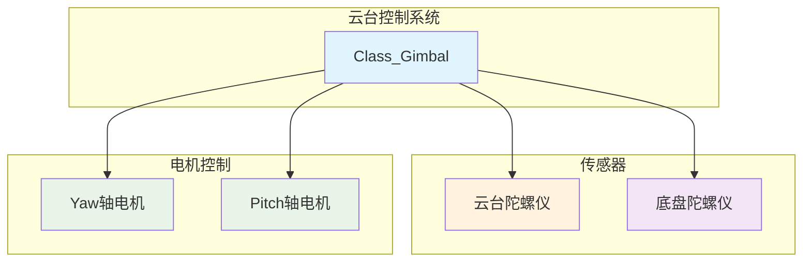
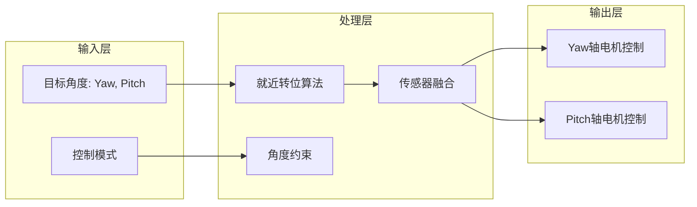
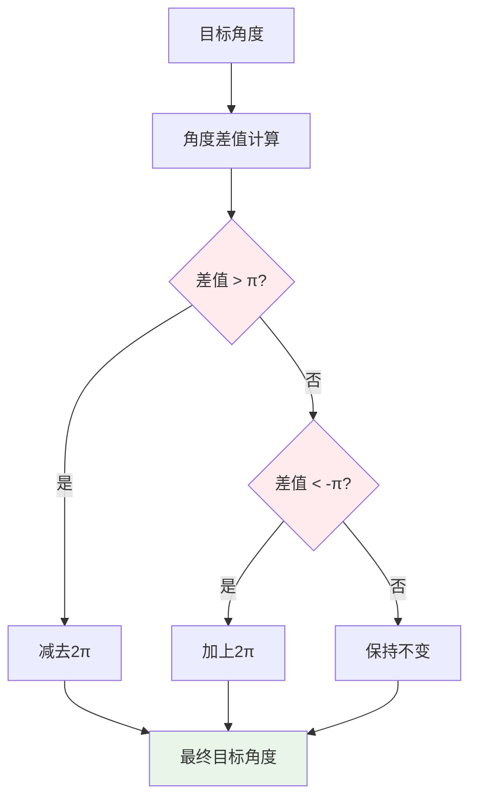
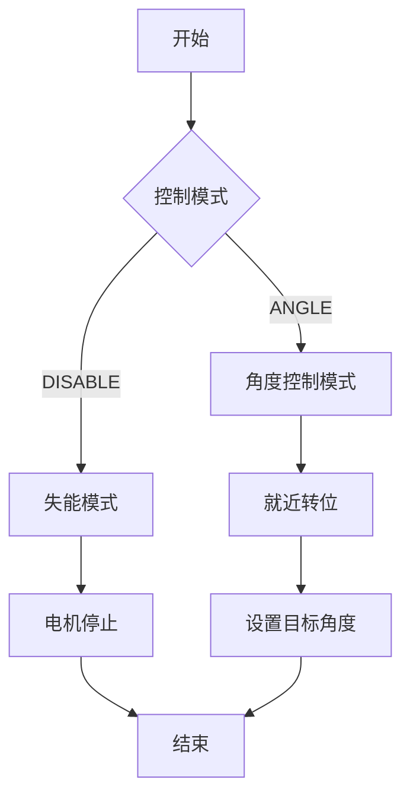

# 云台电控系统深度解析

## 1. 系统架构图



## 2. 系统层次结构图



## 3. 头文件分析 (crt_gimbal.h)

### 3.1 文件概述

这是一个用于云台电控的驱动头文件，版本0.1于2023年8月29日定稿，实现了基于陀螺仪的高精度云台控制。

### 3.2 包含的头文件

```cpp
#include "3_Chariot/1_Module/Gimbal/Gimbal_Motor/crt_gimbal_motor.h"  // 云台电机
#include "2_Device/AHRS/AHRS_WHEELTEC/dvc_ahrs_wheeltec.h"           // 底盘陀螺仪
#include "2_Device/AHRS/AHRS_WIT/dvc_ahrs_wit.h"                     // 云台陀螺仪
```

### 3.3 控制类型枚举

```cpp
enum Enum_Gimbal_Control_Type
{
    Gimbal_Control_Type_DISABLE = 0,  // 失能状态
    Gimbal_Control_Type_ANGLE,        // 角度控制状态
};
```

**作用**: 定义云台的控制模式。

### 3.4 云台主类定义

#### 3.4.1 传感器指针

```cpp
public:
    Class_AHRS_WIT *AHRS_Gimbal;       // 云台陀螺仪指针
    Class_AHRS_WHEELTEC *AHRS_Chassis; // 底盘陀螺仪指针
```

#### 3.4.2 电机对象

```cpp
public:
    Class_Gimbal_Yaw_Motor_DJI_GM6020 Motor_Yaw;    // Yaw轴电机
    Class_Gimbal_Pitch_Motor_DJI_GM6020 Motor_Pitch; // Pitch轴电机
```

#### 3.4.3 初始化函数

```cpp
void Init();  // 系统初始化
```

#### 3.4.4 状态获取函数

```cpp
// 角度获取
inline float Get_Now_Yaw_Angle();      // 获取当前Yaw角度
inline float Get_Now_Pitch_Angle();    // 获取当前Pitch角度

// 角速度获取
inline float Get_Now_Yaw_Omega();      // 获取当前Yaw角速度
inline float Get_Now_Pitch_Omega();    // 获取当前Pitch角速度

// 目标值获取
inline float Get_Target_Yaw_Angle();   // 获取目标Yaw角度
inline float Get_Target_Pitch_Angle(); // 获取目标Pitch角度
inline float Get_Target_Yaw_Omega();   // 获取目标Yaw角速度
inline float Get_Target_Pitch_Omega(); // 获取目标Pitch角速度
```

#### 3.4.5 控制设置函数

```cpp
inline void Set_Gimbal_Control_Type(Enum_Gimbal_Control_Type __Gimbal_Control_Type);  // 设置控制模式
inline void Set_Target_Yaw_Angle(float __Target_Yaw_Angle);      // 设置目标Yaw角度
inline void Set_Target_Pitch_Angle(float __Target_Pitch_Angle);  // 设置目标Pitch角度
inline void Set_Target_Yaw_Omega(float __Target_Yaw_Omega);      // 设置目标Yaw角速度
inline void Set_Target_Pitch_Omega(float __Target_Pitch_Omega);  // 设置目标Pitch角速度
```

#### 3.4.6 定时器回调函数

```cpp
void TIM_100ms_Alive_PeriodElapsedCallback();  // 100ms存活检测
void TIM_1ms_Resolution_PeriodElapsedCallback();  // 1ms解算
void TIM_1ms_Control_PeriodElapsedCallback();    // 1ms控制
```

#### 3.4.7 内部常量和变量

```cpp
protected:
    // 角度限制
    float Min_Pitch_Angle = -0.60f;  // Pitch最小角度
    float Max_Pitch_Angle = 0.33f;   // Pitch最大角度

    // 状态变量
    float Now_Yaw_Angle = 0.0f;      // 当前Yaw角度
    float Now_Pitch_Angle = 0.0f;    // 当前Pitch角度
    float Target_Yaw_Angle = 0.0f;   // 目标Yaw角度
    float Target_Pitch_Angle = 0.0f; // 目标Pitch角度
```

#### 3.4.8 内部函数

```cpp
void Self_Resolution();              // 自我状态解算
void Output();                       // 输出到电机
void _Motor_Nearest_Transposition(); // 电机就近转位
```

## 4. 实现文件分析 (crt_gimbal.cpp)

### 4.1 初始化函数

#### 4.1.1 系统初始化

```cpp
void Class_Gimbal::Init()
{
    // Yaw轴电机初始化
    Motor_Yaw.PID_Angle.Init(7.0f, 0.0f, 0.0f, 0.0f, 2.0f * PI, 2.0f * PI);      // 角度PID
    Motor_Yaw.PID_Omega.Init(0.366f, 0.916f, 0.0f, 0.0f, 3.0f, 3.0f);            // 速度PID
    Motor_Yaw.PID_AHRS_Angle.Init(6.0f, 0.0f, 0.00f, 0.0f, 2.0f * PI, 2.0f * PI); // 陀螺仪角度PID
    Motor_Yaw.PID_AHRS_Omega.Init(1.5f, 30.0f, 0.0f, 0.0f, 0.7f, 3.0f);          // 陀螺仪速度PID
    
    // 绑定传感器指针
    Motor_Yaw.AHRS_Gimbal = AHRS_Gimbal;
    Motor_Yaw.AHRS_Chassis = AHRS_Chassis;
    Motor_Yaw.Motor_Pitch = &Motor_Pitch;  // 关联Pitch电机
    
    // 电机初始化
    Motor_Yaw.Init(&hcan1, Motor_DJI_ID_0x205, Motor_DJI_Control_Method_ANGLE, 3424, Motor_DJI_GM6020_Driver_Version_2023);

    // Pitch轴电机初始化（类似处理）
    Motor_Pitch.PID_Angle.Init(7.0f, 0.0f, 0.0f, 0.0f, 6.0f * PI, 6.0f * PI);
    Motor_Pitch.PID_Omega.Init(0.366f, 0.916f, 0.0f, 0.0f, 3.0f, 3.0f);
    Motor_Pitch.PID_AHRS_Angle.Init(10.0f, 0.0f, 0.000f, 0.0f, 6.0f * PI, 6.0f * PI);
    Motor_Pitch.PID_AHRS_Omega.Init(1.6f, 40.0f, 0.00000f, 0.0f, 1.5f, 3.0f);
    
    Motor_Pitch.AHRS_Gimbal = AHRS_Gimbal;
    Motor_Pitch.Init(&hcan1, Motor_DJI_ID_0x206, Motor_DJI_Control_Method_ANGLE, -3111, Motor_DJI_GM6020_Driver_Version_2023);
}
```

**作用**: 初始化所有PID控制器、传感器绑定和电机配置。

### 4.2 主控制循环

#### 4.2.1 解算循环（1ms）

```cpp
void Class_Gimbal::TIM_1ms_Resolution_PeriodElapsedCallback()
{
    Self_Resolution();  // 自我状态解算
}
```

#### 4.2.2 控制循环（1ms）

```cpp
void Class_Gimbal::TIM_1ms_Control_PeriodElapsedCallback()
{
    Output();  // 输出控制信号

    // 执行电机控制计算
    Motor_Yaw.TIM_Calculate_PeriodElapsedCallback();
    Motor_Pitch.TIM_Calculate_PeriodElapsedCallback();
}
```

### 4.3 核心算法函数

#### 4.3.1 自我状态解算

```cpp
void Class_Gimbal::Self_Resolution()
{
    // 获取当前角度
    Now_Yaw_Angle = Motor_Yaw.Get_Now_Angle();

    // Pitch轴角度归化到±π之间
    Now_Pitch_Angle = Math_Modulus_Normalization(-Motor_Pitch.Get_Now_Angle(), 2.0f * PI);

    // 获取陀螺仪角速度
    Now_Yaw_Omega = Motor_Yaw.Get_Now_AHRS_Omega();
    Now_Pitch_Omega = -Motor_Pitch.Get_Now_AHRS_Omega();  // 注意负号
}
```

**作用**: 更新云台的实时状态，使用陀螺仪数据提高精度。

#### 4.3.2 输出控制函数

```cpp
void Class_Gimbal::Output()
{
    if (Gimbal_Control_Type == Gimbal_Control_Type_DISABLE)
    {
        // 云台失能模式：所有电机停止
        Motor_Yaw.Set_Control_Method(Motor_DJI_Control_Method_CURRENT);
        Motor_Pitch.Set_Control_Method(Motor_DJI_Control_Method_CURRENT);

        // 重置所有PID积分器
        Motor_Yaw.PID_Angle.Set_Integral_Error(0.0f);
        Motor_Yaw.PID_Omega.Set_Integral_Error(0.0f);
        Motor_Yaw.PID_Current.Set_Integral_Error(0.0f);
        Motor_Yaw.PID_AHRS_Angle.Set_Integral_Error(0.0f);
        Motor_Yaw.PID_AHRS_Omega.Set_Integral_Error(0.0f);
        Motor_Pitch.PID_Angle.Set_Integral_Error(0.0f);
        Motor_Pitch.PID_Omega.Set_Integral_Error(0.0f);
        Motor_Pitch.PID_Current.Set_Integral_Error(0.0f);
        Motor_Pitch.PID_AHRS_Angle.Set_Integral_Error(0.0f);
        Motor_Pitch.PID_AHRS_Omega.Set_Integral_Error(0.0f);

        // 设置零输出
        Motor_Yaw.Set_Target_Current(0.0f);
        Motor_Yaw.Set_Feedforward_Omega(0.0f);
        Motor_Pitch.Set_Target_Current(0.0f);
        Motor_Pitch.Set_Feedforward_Current(0.0f);
    }
    else if (Gimbal_Control_Type == Gimbal_Control_Type_ANGLE)
    {
        // 角度控制模式
        Motor_Yaw.Set_Control_Method(Motor_DJI_Control_Method_ANGLE);
        Motor_Pitch.Set_Control_Method(Motor_DJI_Control_Method_ANGLE);

        _Motor_Nearest_Transposition();  // 就近转位处理

        // 设置目标角度
        Motor_Yaw.Set_Target_Angle(Target_Yaw_Angle);
        Motor_Pitch.Set_Target_Angle(-Target_Pitch_Angle);  // 注意负号
    }
}
```

**作用**: 根据控制模式执行相应的输出逻辑。

#### 4.3.3 就近转位算法

```cpp
void Class_Gimbal::_Motor_Nearest_Transposition()
{
    // Yaw轴就近转位
    float tmp_delta_angle;
    tmp_delta_angle = fmod(Target_Yaw_Angle - Now_Yaw_Angle, 2.0f * PI);
    if (tmp_delta_angle > PI)
    {
        tmp_delta_angle -= 2.0f * PI;
    }
    else if (tmp_delta_angle < -PI)
    {
        tmp_delta_angle += 2.0f * PI;
    }
    Target_Yaw_Angle = Motor_Yaw.Get_Now_Angle() + tmp_delta_angle;

    // Pitch轴处理
    Math_Constrain(&Target_Pitch_Angle, Min_Pitch_Angle, Max_Pitch_Angle);  // 角度约束
    tmp_delta_angle = Target_Pitch_Angle - Now_Pitch_Angle;
    Target_Pitch_Angle = -Motor_Pitch.Get_Now_Angle() + tmp_delta_angle;  // 注意负号
}
```

**作用**: 优化电机转向路径，选择最短路径到达目标角度。

## 5. 就近转位算法详解



## 6. 坐标系说明

```
云台陀螺仪对应关系:
x轴 -> pitch (俯仰)
z轴 -> yaw (偏航)
```

- **Yaw轴**: Z轴旋转，水平转动
- **Pitch轴**: X轴旋转，上下转动
- **坐标变换**: 考虑了机械安装的负号关系

## 7. 控制模式流程图



## 8. 关键特性分析

### 8.1 传感器融合

- **双重陀螺仪**: 云台+底盘陀螺仪
- **自适应控制**: 根据传感器状态选择控制策略
- **高精度反馈**: 陀螺仪数据提高控制精度

### 8.2 智能算法

- **就近转位**: 优化电机转向路径
- **角度约束**: 防止超限运行
- **积分复位**: 防止积分饱和

### 8.3 安全保护

- **模式切换**: 不同模式下的安全处理
- **故障保护**: 电机异常时的保护措施
- **状态监控**: 实时监控系统状态

## 9. 类的作用域和外设资源

### 9.1 作用域

- **公共作用域(public)**: 提供完整的控制接口和状态查询
- **保护作用域(protected)**: 内部算法逻辑和参数管理

### 9.2 使用的外设资源

- **CAN接口**: 与2个DJI GM6020电机通信
- **WIT陀螺仪**: 云台姿态感知
- **WHEELETEC陀螺仪**: 底盘姿态感知
- **定时器**: 1ms控制周期，100ms存活检测
- **内存资源**: PID参数、传感器数据、控制状态
- **数学库**: 三角函数、模运算等

### 9.3 工作流程

1. **初始化**: 配置传感器、PID和电机参数
2. **状态解算**: 1ms周期更新云台状态
3. **控制计算**: 1ms周期执行控制算法
4. **就近转位**: 优化目标角度路径
5. **电机输出**: 控制Yaw和Pitch电机

这个云台电控系统通过融合多个传感器数据，实现了高精度的双轴云台控制，具有智能的路径规划和安全保护功能，适用于需要稳定瞄准的机器人应用。