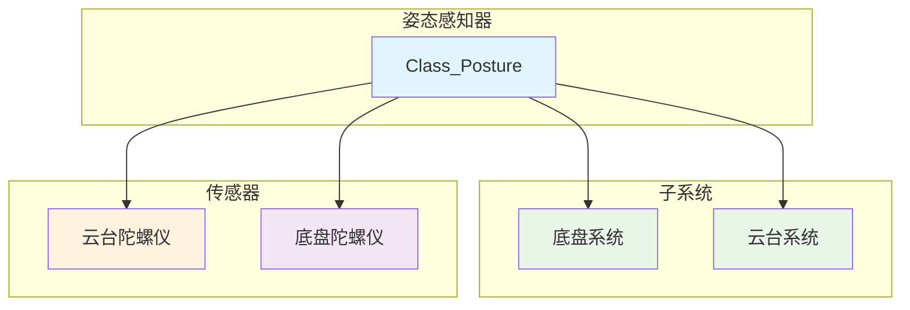
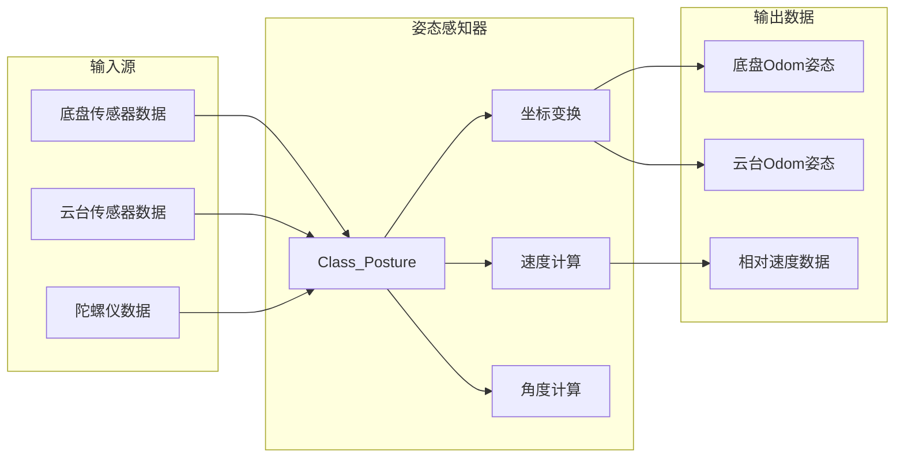
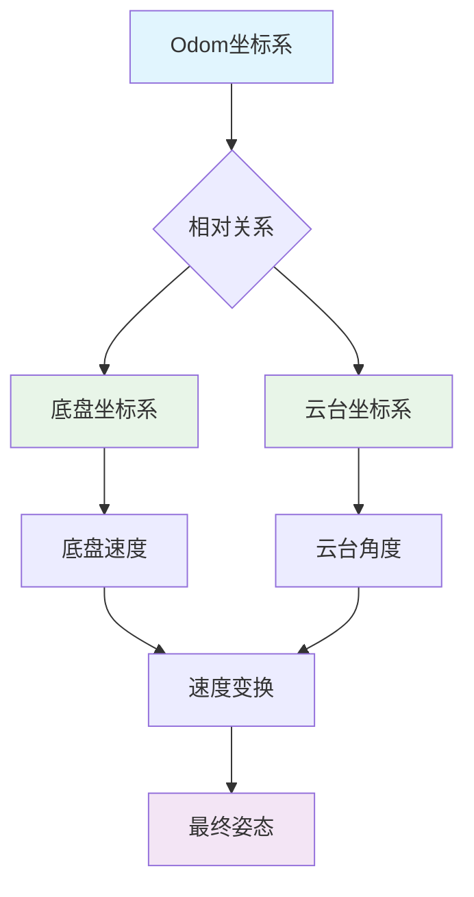
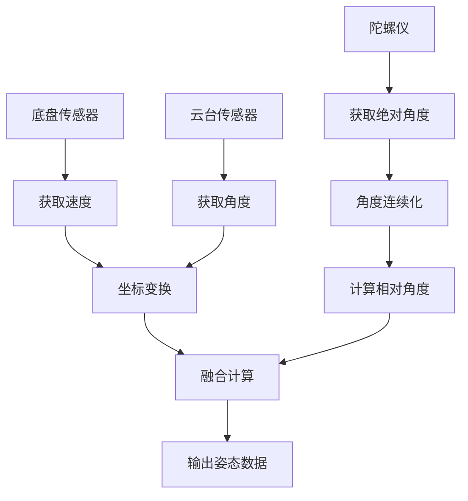

# 战车姿态感知器系统深度解析

## 1. 系统架构图



## 2. 数据流图



## 3. 头文件分析 (crt_posture.h)

### 3.1 文件概述

这是一个用于战车姿态感知的驱动头文件，版本0.1于2024年6月13日新建，实现了底盘和云台的姿态融合感知。

### 3.2 包含的头文件

```cpp
#include "3_Chariot/1_Module/Chassis/crt_chassis.h"     // 底盘系统
#include "3_Chariot/1_Module/Gimbal/crt_gimbal.h"       // 云台系统
#include "2_Device/AHRS/AHRS_WHEELTEC/dvc_ahrs_wheeltec.h"  // 底盘陀螺仪
#include "2_Device/AHRS/AHRS_WIT/dvc_ahrs_wit.h"        // 云台陀螺仪
```

### 3.3 姿态感知器主类定义

#### 3.3.1 子系统指针

```cpp
public:
    Class_Chassis *Chassis;  // 底盘指针
    Class_Gimbal *Gimbal;    // 云台指针
```

#### 3.3.2 传感器对象

```cpp
public:
    Class_AHRS_WIT AHRS_Gimbal;       // 云台陀螺仪对象
    Class_AHRS_WHEELTEC AHRS_Chassis; // 底盘陀螺仪对象
```

#### 3.3.3 旋转矩阵

```cpp
public:
    Eigen::Matrix3f Matrix_Chassis_Odom_Rotation;  // 底盘到Odom旋转矩阵
    Eigen::Matrix3f Matrix_Gimbal_Odom_Rotation;   // 云台到Odom旋转矩阵
    Eigen::Matrix3f Matrix_Gimbal_Chassis_Rotation; // 云台到底盘旋转矩阵
```

#### 3.3.4 初始化函数

```cpp
void Init();  // 系统初始化
```

#### 3.3.5 底盘状态获取函数

```cpp
// 速度获取
inline float Get_Chassis_Velocity_X();  // 底盘X轴速度
inline float Get_Chassis_Velocity_Y();  // 底盘Y轴速度
inline float Get_Chassis_Omega();       // 底盘角速度

// 角度获取
inline float Get_Chassis_Odom_Angle_Yaw();   // 底盘偏航角
inline float Get_Chassis_Odom_Angle_Pitch(); // 底盘俯仰角
inline float Get_Chassis_Odom_Angle_Roll();  // 底盘横滚角
```

#### 3.3.6 云台状态获取函数

```cpp
// 速度获取
inline float Get_Gimbal_Velocity_X();  // 云台X轴速度
inline float Get_Gimbal_Velocity_Y();  // 云台Y轴速度

// 角速度获取
inline float Get_Gimbal_Omega_Yaw();   // 云台偏航角速度
inline float Get_Gimbal_Omega_Pitch(); // 云台俯仰角速度

// 角度获取
inline float Get_Gimbal_Odom_Angle_Yaw();   // 云台偏航角
inline float Get_Gimbal_Odom_Angle_Pitch(); // 云台俯仰角
inline float Get_Gimbal_Odom_Angle_Roll();  // 云台横滚角
```

#### 3.3.7 定时器回调函数

```cpp
void TIM_100ms_Alive_PeriodElapsedCallback();    // 100ms存活检测
void TIM_1ms_Calculate_PeriodElapsedCallback();  // 1ms计算
```

#### 3.3.8 内部变量

```cpp
protected:
    // 底盘状态
    float Chassis_Velocity_X, Chassis_Velocity_Y, Chassis_Omega;
    float Chassis_Odom_Angle_Yaw, Chassis_Odom_Angle_Pitch, Chassis_Odom_Angle_Roll;

    // 云台状态
    float Gimbal_Velocity_X, Gimbal_Velocity_Y;
    float Gimbal_Omega_Yaw, Gimbal_Omega_Pitch;
    float Gimbal_Odom_Angle_Yaw, Gimbal_Odom_Angle_Pitch, Gimbal_Odom_Angle_Roll;
```

## 4. 实现文件分析 (crt_posture.cpp)

### 4.1 初始化函数

#### 4.1.1 系统初始化

```cpp
void Class_Posture::Init()
{
    AHRS_Chassis.Init(&huart7);  // 初始化底盘陀螺仪
    AHRS_Gimbal.Init(&huart8);   // 初始化云台陀螺仪
}
```

**作用**: 初始化两个陀螺仪模块。

### 4.2 主控制循环

#### 4.2.1 存活检测（100ms）

```cpp
void Class_Posture::TIM_100ms_Alive_PeriodElapsedCallback()
{
    AHRS_Chassis.TIM_100ms_Alive_PeriodElapsedCallback();  // 底盘陀螺仪存活检测
    AHRS_Gimbal.TIM_100ms_Alive_PeriodElapsedCallback();   // 云台陀螺仪存活检测
}
```

**作用**: 定期检测陀螺仪模块是否正常工作。

#### 4.2.2 姿态计算（1ms）

```cpp
void Class_Posture::TIM_1ms_Calculate_PeriodElapsedCallback()
{
    // 获取底盘速度
    Chassis_Velocity_X = Chassis->Get_Now_Velocity_X();
    Chassis_Velocity_Y = Chassis->Get_Now_Velocity_Y();
    Chassis_Omega = Chassis->Get_Now_AHRS_Omega();

    // 云台偏航角连续化处理
    float gimbal_yaw, tmp_delta_gimbal_yaw;
    tmp_delta_gimbal_yaw = Math_Modulus_Normalization(AHRS_Gimbal.Get_Angle_Yaw() - Gimbal_Odom_Angle_Yaw, 2.0f * PI);
    gimbal_yaw = Gimbal_Odom_Angle_Yaw + tmp_delta_gimbal_yaw;

    // 计算底盘在Odom坐标系的角度
    Chassis_Odom_Angle_Yaw = gimbal_yaw - Gimbal->Get_Now_Yaw_Angle();
    Chassis_Odom_Angle_Pitch = Chassis->Get_Angle_Pitch();
    Chassis_Odom_Angle_Roll = Chassis->Get_Angle_Roll();

    // 速度坐标变换：从底盘坐标系转换到云台坐标系
    float cos_gimbal_yaw, sin_gimbal_yaw;
    cos_gimbal_yaw = arm_cos_f32(-Gimbal->Get_Now_Yaw_Angle());
    sin_gimbal_yaw = arm_sin_f32(-Gimbal->Get_Now_Yaw_Angle());
    Gimbal_Velocity_X = Chassis_Velocity_X * cos_gimbal_yaw + Chassis_Velocity_Y * (-sin_gimbal_yaw);
    Gimbal_Velocity_Y = Chassis_Velocity_X * sin_gimbal_yaw + Chassis_Velocity_Y * cos_gimbal_yaw;

    // 云台角速度
    Gimbal_Omega_Yaw = Gimbal->Get_Now_Yaw_Omega();
    Gimbal_Omega_Pitch = Gimbal->Get_Now_Pitch_Omega();

    // 云台在Odom坐标系的角度
    Gimbal_Odom_Angle_Yaw = gimbal_yaw;
    Gimbal_Odom_Angle_Pitch = AHRS_Gimbal.Get_Angle_Pitch();
    Gimbal_Odom_Angle_Roll = AHRS_Gimbal.Get_Angle_Roll();

    // 旋转矩阵计算（注释掉的部分）
    // Matrix_Chassis_Odom_Rotation = Eigen::AngleAxisf(Chassis_Odom_Angle_Yaw, Eigen::Vector3f::UnitZ()) * ...
    // Matrix_Gimbal_Odom_Rotation = Eigen::AngleAxisf(Gimbal_Odom_Angle_Yaw, Eigen::Vector3f::UnitZ()) * ...
    // Matrix_Gimbal_Chassis_Rotation = Eigen::AngleAxisf(Gimbal->Get_Now_Yaw_Angle(), Eigen::Vector3f::UnitZ()) * ...
}
```

### 4.3 关键算法分析

#### 4.3.1 角度连续化处理

```cpp
tmp_delta_gimbal_yaw = Math_Modulus_Normalization(AHRS_Gimbal.Get_Angle_Yaw() - Gimbal_Odom_Angle_Yaw, 2.0f * PI);
gimbal_yaw = Gimbal_Odom_Angle_Yaw + tmp_delta_gimbal_yaw;
```

**作用**: 解决角度跳变问题，确保角度的连续性。

#### 4.3.2 坐标系变换算法

```cpp
// 从底盘坐标系到云台坐标系的速度变换
cos_gimbal_yaw = arm_cos_f32(-Gimbal->Get_Now_Yaw_Angle());
sin_gimbal_yaw = arm_sin_f32(-Gimbal->Get_Now_Yaw_Angle());
Gimbal_Velocity_X = Chassis_Velocity_X * cos_gimbal_yaw + Chassis_Velocity_Y * (-sin_gimbal_yaw);
Gimbal_Velocity_Y = Chassis_Velocity_X * sin_gimbal_yaw + Chassis_Velocity_Y * cos_gimbal_yaw;
```

**变换矩阵**:

```
[ V_gimbal_x ]   [ cos(θ)  -sin(θ) ] [ V_chassis_x ]
[ V_gimbal_y ] = [ sin(θ)   cos(θ) ] [ V_chassis_y ]
```

#### 4.3.3 底盘角度计算

```cpp
Chassis_Odom_Angle_Yaw = gimbal_yaw - Gimbal->Get_Now_Yaw_Angle();
```

**作用**: 通过云台绝对角度减去云台相对于底盘的角度，得到底盘的绝对角度。

## 5. 坐标系关系图



## 6. 数据流向图



## 7. 关键特性分析

### 7.1 坐标系管理

- **Odom坐标系**: 全局参考坐标系
- **底盘坐标系**: 底盘自身的移动坐标系
- **云台坐标系**: 云台自身的旋转坐标系

### 7.2 传感器融合

- **双重陀螺仪**: 底盘+云台陀螺仪数据融合
- **连续化处理**: 解决角度跳变问题
- **实时计算**: 1ms频率更新姿态数据

### 7.3 坐标变换

- **速度变换**: 底盘速度转换到云台坐标系
- **角度计算**: 通过相对关系计算绝对角度
- **矩阵运算**: 支持旋转矩阵计算（暂未启用）

## 8. 类的作用域和外设资源

### 8.1 作用域

- **公共作用域(public)**: 提供完整的姿态数据访问接口
- **保护作用域(protected)**: 内部计算状态和中间变量

### 8.2 使用的外设资源

- **UART接口**: huart7(底盘陀螺仪), huart8(云台陀螺仪)
- **AHRS模块**: WHEELETEC和WIT陀螺仪
- **定时器**: 1ms计算周期，100ms存活检测
- **内存资源**: 姿态数据、旋转矩阵、中间计算变量
- **数学库**: 三角函数、Eigen矩阵运算
- **底盘和云台系统**: 作为输入数据源

### 8.3 工作流程

1. **初始化**: 配置两个陀螺仪模块
2. **数据采集**: 从底盘、云台和陀螺仪获取原始数据
3. **角度连续化**: 处理角度跳变问题
4. **坐标变换**: 执行坐标系转换计算
5. **姿态融合**: 计算最终的姿态数据
6. **数据输出**: 提供统一的姿态查询接口

这个姿态感知器系统通过融合多个传感器的数据，实现了精确的战车姿态感知，支持多坐标系下的姿态计算和速度变换，为机器人导航和控制提供了可靠的姿态基础。