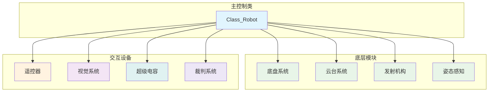
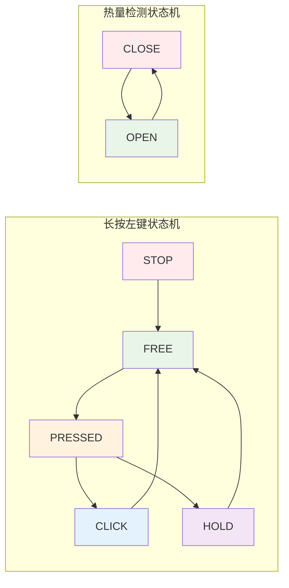
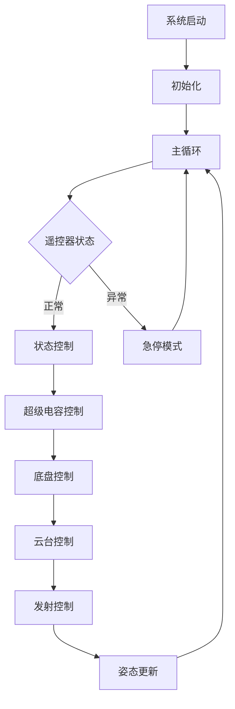

# 人机交互控制逻辑系统深度解析

## 1. 系统架构图



## 2. 状态机系统图



## 3. 头文件分析 (ita_robot.h)

### 3.1 文件概述

这是一个用于人机交互控制逻辑的驱动头文件，版本1.1于2024年1月17日更新，引入了新的功能和状态机系统。

### 3.2 包含的头文件

```cpp
#include "3_Chariot/1_Module/Chassis/crt_chassis.h"      // 底盘系统
#include "3_Chariot/1_Module/Gimbal/crt_gimbal.h"        // 云台系统
#include "3_Chariot/1_Module/Booster/crt_booster.h"      // 发射机构
#include "3_Chariot/2_Posture/Posture/crt_posture.h"     // 姿态感知器
#include "2_Device/DR16/dvc_dr16.h"                      // 遥控器
#include "2_Device/Manifold/dvc_manifold.h"              // 视觉系统
#include "2_Device/Supercap/Supercap_24/dvc_supercap_24.h" // 超级电容
#include "2_Device/Referee/dvc_referee.h"                // 裁判系统
#include "1_Middleware/2_Algorithm/Timer/alg_timer.h"    // 定时器
#include "1_Middleware/2_Algorithm/Queue/alg_queue.h"    // 队列
```

### 3.3 枚举类型定义

#### 3.3.1 长按左键状态类型

```cpp
enum Enum_FSM_Press_Hold_Status
{
    FSM_Press_Hold_Status_STOP = 0,    // 停止状态
    FSM_Press_Hold_Status_FREE,        // 释放状态
    FSM_Press_Hold_Status_PRESSED,     // 按下状态
    FSM_Press_Hold_Status_CLICK,       // 单击状态
    FSM_Press_Hold_Status_HOLD,        // 长按状态
};
```

#### 3.3.2 热量检测状态类型

```cpp
enum Enum_FSM_Heat_Detector_Status
{
    FSM_Heat_Detector_Status_CLOSE = 0,  // 关闭状态
    FSM_Heat_Detector_Status_OPEN,       // 开启状态
};
```

#### 3.3.3 底盘类型

```cpp
enum Enum_Robot_Chassis_Type
{
    Robot_Chassis_Type_POWER = 0,  // 功率优先
    Robot_Chassis_Type_HP,         // 血量优先
};
```

#### 3.3.4 小陀螺类型

```cpp
enum Enum_Robot_Gyroscope_Type
{
    Robot_Gyroscope_Type_DISABLE = 0,     // 禁用
    Robot_Gyroscope_Type_CLOCKWISE,       // 顺时针
    Robot_Gyroscope_Type_COUNTERCLOCKWISE, // 逆时针
};
```

#### 3.3.5 发射机构类型

```cpp
enum Enum_Robot_Booster_Type
{
    Robot_Booster_Type_BURST = 0,  // 爆发优先
    Robot_Booster_Type_CD,         // 冷却优先
};
```

### 3.4 长按左键状态机类

#### 3.4.1 类定义

```cpp
class Class_FSM_Press_Hold : public Class_FSM
{
public:
    Class_Robot *Robot;  // 机器人指针

    uint32_t Get_Default_Hold_Time_Threshold();  // 获取默认长按时间阈值
    void Set_Hold_Time_Threshold(uint32_t __Hold_Time_Threshold);  // 设置长按时间阈值
    void TIM_1ms_Calculate_PeriodElapsedCallback();  // 1ms计算回调

protected:
    uint32_t Default_Hold_Time_Threshold = 98;  // 默认长按时间阈值
    uint32_t Hold_Time_Threshold = 98;          // 长按时间阈值
};
```

### 3.5 热量检测状态机类

#### 3.5.1 类定义

```cpp
class Class_FSM_Heat_Detector : public Class_FSM
{
public:
    Class_Robot *Robot;  // 机器人指针

    float Get_Now_Heat();           // 获取当前热量
    uint32_t Get_Total_Ammo_Num();  // 获取累计子弹数
    void TIM_1ms_Calculate_PeriodElapsedCallback();  // 1ms计算回调

protected:
    uint32_t Max_Queue_Size = 100;              // 最大队列长度
    float Current_Queue_Sum_Threshold = 100000.0f;  // 电流队列和阈值
    Class_Queue<float, 100> Current_Queue;      // 电流值队列
    float Current_Queue_Sum = 0.0f;             // 电流值队列和
    float Now_Heat = 0.0f;                      // 当前热量
    uint32_t Total_Ammo_Num = 0;                // 累计子弹数
};
```

### 3.6 主机器人类定义

#### 3.6.1 状态机和定时器

```cpp
public:
    Class_FSM_Press_Hold FSM_DR16_Left_Mouse_Press_Hold;  // 长按左键状态机
    Class_FSM_Heat_Detector FSM_Heat_Detector;            // 热量检测状态机
    Class_Timer Timer_Turn_About;                         // 一键调头定时器
    Class_Timer Timer_Switch_Target;                      // 视觉切换目标定时器
    Class_Timer Timer_Rune_To_Armor;                      // 能量机关定时器
```

#### 3.6.2 PID控制器

```cpp
public:
    Class_PID PID_Chassis_Follow;              // 底盘跟随PID
    Class_PID PID_Supercap_Chassis_Power;      // 超级电容功率PID
    Class_PID PID_Referee_Chassis_Power;       // 裁判系统功率PID
```

#### 3.6.3 斜坡函数

```cpp
public:
    Class_Slope Slope_Speed_X;   // X轴速度斜坡
    Class_Slope Slope_Speed_Y;   // Y轴速度斜坡
    Class_Slope Slope_Omega;     // 角速度斜坡
```

#### 3.6.4 设备对象

```cpp
public:
    Class_DR16 DR16;          // 遥控器
    Class_Manifold Manifold;  // 视觉系统
    Class_Supercap_24 Supercap;  // 超级电容
    Class_Referee Referee;    // 裁判系统
    Class_Chassis Chassis;    // 底盘
    Class_Gimbal Gimbal;      // 云台
    Class_Booster Booster;    // 发射机构
    Class_Posture Posture;    // 姿态感知器
```

#### 3.6.5 初始化和主循环函数

```cpp
void Init();  // 初始化
void Loop();  // 主循环
```

#### 3.6.6 定时器回调函数

```cpp
void TIM_1000ms_Alive_PeriodElapsedCallback();    // 1000ms存活检测
void TIM_100ms_Alive_PeriodElapsedCallback();     // 100ms存活检测
void TIM_100ms_Calculate_Callback();              // 100ms计算
void TIM_10ms_Calculate_PeriodElapsedCallback();  // 10ms计算
void TIM_2ms_Calculate_PeriodElapsedCallback();   // 2ms计算
void TIM_1ms_Calculate_Callback();                // 1ms计算
```

## 4. 实现文件分析 (ita_robot.cpp)

### 4.1 功率表定义

#### 4.1.1 功率优先功率表

```cpp
static const float chassis_power_first_power[10] = {
    60.0f, 65.0f, 70.0f, 75.0f, 80.0f, 
    85.0f, 90.0f, 95.0f, 100.0f, 100.0f
};
```

#### 4.1.2 血量优先功率表

```cpp
static const float chassis_hp_first_power[10] = {
    45.0f, 50.0f, 55.0f, 60.0f, 65.0f, 
    70.0f, 75.0f, 80.0f, 90.0f, 100.0f
};
```

#### 4.1.3 爆发优先热量表

```cpp
static const float booster_burst_first_heat_max[10] = {
    200.0f, 250.0f, 300.0f, 350.0f, 400.0f, 
    450.0f, 500.0f, 550.0f, 600.0f, 650.0f
};
```

### 4.2 长按左键状态机实现

#### 4.2.1 状态转移逻辑

```cpp
void Class_FSM_Press_Hold::TIM_1ms_Calculate_PeriodElapsedCallback()
{
    Status[Now_Status_Serial].Count_Time++;  // 累计时间

    switch (Now_Status_Serial)
    {
    case (FSM_Press_Hold_Status_STOP):
    {
        // 停机状态 -> 按下状态
        if (Robot->DR16.Get_Mouse_Left_Key() == DR16_Key_Status_TRIG_FREE_PRESSED)
        {
            Set_Status(FSM_Press_Hold_Status_PRESSED);
        }
        break;
    }
    case (FSM_Press_Hold_Status_FREE):
    {
        // 释放状态 -> 按下状态
        if (Robot->DR16.Get_Mouse_Left_Key() == DR16_Key_Status_TRIG_FREE_PRESSED)
        {
            Set_Status(FSM_Press_Hold_Status_PRESSED);
        }
        break;
    }
    case (FSM_Press_Hold_Status_PRESSED):
    {
        // 按下状态
        if (Robot->DR16.Get_Mouse_Left_Key() == DR16_Key_Status_TRIG_PRESSED_FREE)
        {
            // 短时间 -> 单击状态
            Set_Status(FSM_Press_Hold_Status_CLICK);
        }
        if (Status[Now_Status_Serial].Count_Time >= Hold_Time_Threshold)
        {
            // 长时间 -> 长按状态
            Set_Status(FSM_Press_Hold_Status_HOLD);
        }
        break;
    }
    case (FSM_Press_Hold_Status_CLICK):
    {
        // 单击状态 -> 释放状态
        Set_Status(FSM_Press_Hold_Status_FREE);
        break;
    }
    case (FSM_Press_Hold_Status_HOLD):
    {
        // 长按状态
        Hold_Time_Threshold = Default_Hold_Time_Threshold;
        if (Robot->DR16.Get_Mouse_Left_Key() == DR16_Key_Status_FREE)
        {
            Set_Status(FSM_Press_Hold_Status_FREE);
        }
        break;
    }
    }
}
```

### 4.3 热量检测状态机实现

#### 4.3.1 状态转移逻辑

```cpp
void Class_FSM_Heat_Detector::TIM_1ms_Calculate_PeriodElapsedCallback()
{
    Status[Now_Status_Serial].Count_Time++;

    switch (Now_Status_Serial)
    {
    case (FSM_Heat_Detector_Status_CLOSE):
    {
        // 关闭状态 -> 开启状态
        if ((Robot->Booster.Motor_Friction_Left.Get_Status() == Motor_DJI_Status_ENABLE && 
             Robot->Booster.Motor_Friction_Right.Get_Status() == Motor_DJI_Status_ENABLE) && 
            (Robot->Booster.Motor_Friction_Left.Get_Target_Omega() > 0.0f && 
             Robot->Booster.Motor_Friction_Right.Get_Target_Omega() < 0.0f) && 
            (Robot->Booster.Motor_Friction_Left.Get_Now_Filter_Omega() >= Robot->Booster.Motor_Friction_Left.Get_Target_Omega() * 0.99f && 
             Robot->Booster.Motor_Friction_Right.Get_Now_Filter_Omega() <= Robot->Booster.Motor_Friction_Right.Get_Target_Omega() * 0.99f))
        {
            Set_Status(FSM_Heat_Detector_Status_OPEN);
        }
        break;
    }
    case (FSM_Heat_Detector_Status_OPEN):
    {
        // 开启状态：检测子弹发射
        float now_current = Robot->Booster.Motor_Friction_Left.Get_Now_Current() - Robot->Booster.Motor_Friction_Right.Get_Now_Current();
        Current_Queue_Sum += now_current;
        Current_Queue.Push(now_current);

        if (Current_Queue.Get_Length() > Max_Queue_Size)
        {
            Current_Queue_Sum -= Current_Queue.Get_Front();
            Current_Queue.Pop();
        }

        if (Current_Queue_Sum > Current_Queue_Sum_Threshold)
        {
            // 检测到子弹发射
            Current_Queue.Clear();
            Current_Queue_Sum = 0.0f;
            Now_Heat += 10.0f;
            Total_Ammo_Num++;
        }

        // 计算冷却
        Now_Heat -= (float)(Robot->Referee.Get_Self_Booster_Heat_CD()) * 0.001f;
        if (Now_Heat < 0.0f)
        {
            Now_Heat = 0.0f;
        }

        if ((Robot->Booster.Motor_Friction_Left.Get_Status() == Motor_DJI_Status_DISABLE && 
             Robot->Booster.Motor_Friction_Right.Get_Status() == Motor_DJI_Status_DISABLE) || 
            (Robot->Booster.Motor_Friction_Left.Get_Target_Omega() == 0.0f && 
             Robot->Booster.Motor_Friction_Right.Get_Target_Omega() == 0.0f))
        {
            // 电机掉线 -> 关闭状态
            Current_Queue.Clear();
            Current_Queue_Sum = 0.0f;
            Now_Heat = 0.0f;
            Set_Status(FSM_Heat_Detector_Status_CLOSE);
        }
        break;
    }
    }
}
```

### 4.4 主机器人初始化

#### 4.4.1 系统初始化

```cpp
void Class_Robot::Init()
{
    // 初始化状态机
    FSM_DR16_Left_Mouse_Press_Hold.Robot = this;
    FSM_DR16_Left_Mouse_Press_Hold.Init(4, FSM_Press_Hold_Status_STOP);

    FSM_Heat_Detector.Robot = this;
    FSM_Heat_Detector.Init(2, FSM_Heat_Detector_Status_CLOSE);

    // 初始化定时器
    Timer_Turn_About.Init(3000);
    Timer_Switch_Target.Init(1);
    Timer_Rune_To_Armor.Init(1);

    // 初始化PID控制器
    PID_Chassis_Follow.Init(3.0f, 0.0f, 0.0f, 0.0f, 4.0f * PI, 4.0f * PI);
    PID_Supercap_Chassis_Power.Init(0.10f, 1.5f, 0.0f, 0.0f, 120.0f, 120.0f, 0.1f, 0.0f, 0.0f, 0.0f, 45.0f);
    PID_Referee_Chassis_Power.Init(0.05f, 1.5f, 0.0f, 0.0f, 120.0f, 120.0f, 0.1f, 0.0f, 0.0f, 0.0f, 45.0f);

    // 初始化斜坡函数
    Slope_Speed_X.Init(2.5f / 1000.0f, 3.0f / 1000.0f);
    Slope_Speed_Y.Init(2.5f / 1000.0f, 5.0f / 1000.0f);
    Slope_Omega.Init(4.0f * PI / 1000.0f, 4.0f * PI / 1000.0f);

    // 初始化设备
    DR16.Init(&huart1);
    Manifold.Init(&huart3);
    Supercap.Init(&hcan2);
    Referee.Init(&huart6);

    // 初始化子系统
    Chassis.AHRS_Chassis = &(Posture.AHRS_Chassis);
    Chassis.Init();

    Gimbal.AHRS_Gimbal = &(Posture.AHRS_Gimbal);
    Gimbal.AHRS_Chassis = &(Posture.AHRS_Chassis);
    Gimbal.Init();

    Booster.Init();
    Posture.Chassis = &Chassis;
    Posture.Gimbal = &Gimbal;
    Posture.Init();
}
```

### 4.5 主控制循环

#### 4.5.1 定时器处理函数

```cpp
void Class_Robot::TIM_100ms_Calculate_Callback()
{
    // 底盘功率控制PID
    if (Supercap.Get_Status() == Supercap_24_Status_ENABLE)
    {
        if (Referee.Get_Status() == Referee_Status_DISABLE || Referee.Get_Referee_Trust_Status() == Referee_Data_Status_DISABLE)
        {
            // 裁判系统掉线或远端信息不可信
            if (Robot_Chassis_Type == Robot_Chassis_Type_POWER)
            {
                PID_Supercap_Chassis_Power.Set_Target(chassis_power_first_power[Robot_Level - 1]);
            }
            else if (Robot_Chassis_Type == Robot_Chassis_Type_HP)
            {
                PID_Supercap_Chassis_Power.Set_Target(chassis_hp_first_power[Robot_Level - 1]);
            }
        }
        else
        {
            // 裁判系统可信
            PID_Supercap_Chassis_Power.Set_Target(Referee.Get_Self_Chassis_Power_Max());
        }
        PID_Supercap_Chassis_Power.Set_Now(Supercap.Get_Chassis_Power());
        PID_Supercap_Chassis_Power.TIM_Calculate_PeriodElapsedCallback();
        PID_Referee_Chassis_Power.Set_Integral_Error(0.0f);
    }
    else if (Referee.Get_Status() == Referee_Status_ENABLE && Referee.Get_Referee_Trust_Status() == Referee_Data_Status_ENABLE)
    {
        PID_Referee_Chassis_Power.Set_Target(Referee.Get_Self_Chassis_Power_Max());
        PID_Referee_Chassis_Power.Set_Now(Referee.Get_Chassis_Power());
        PID_Referee_Chassis_Power.TIM_Calculate_PeriodElapsedCallback();
        PID_Supercap_Chassis_Power.Set_Integral_Error(0.0f);
    }
    else
    {
        PID_Supercap_Chassis_Power.Set_Integral_Error(0.0f);
        PID_Referee_Chassis_Power.Set_Integral_Error(0.0f);
    }
}
```

#### 4.5.2 1ms主控制函数

```cpp
void Class_Robot::TIM_1ms_Calculate_Callback()
{
    // 定时器更新
    Timer_Turn_About.TIM_1ms_Calculate_PeriodElapsedCallback();
    Timer_Switch_Target.TIM_1ms_Calculate_PeriodElapsedCallback();
    Timer_Rune_To_Armor.TIM_1ms_Calculate_PeriodElapsedCallback();
    FSM_DR16_Left_Mouse_Press_Hold.TIM_1ms_Calculate_PeriodElapsedCallback();

    // 遥控器处理
    DR16.TIM_1ms_Calculate_PeriodElapsedCallback();

    // 状态控制
    _Status_Control();
    _Supercap_Control();
    _Chassis_Control();
    _Gimbal_Control();
    _Booster_Control();

    // 子系统控制
    Gimbal.TIM_1ms_Resolution_PeriodElapsedCallback();
    Gimbal.TIM_1ms_Control_PeriodElapsedCallback();
    Booster.TIM_1ms_Calculate_PeriodElapsedCallback();
    Posture.TIM_1ms_Calculate_PeriodElapsedCallback();
}
```

### 4.6 状态控制逻辑

#### 4.6.1 状态控制函数

```cpp
void Class_Robot::_Status_Control()
{
    // 遥控器状态检查
    if (DR16.Get_Status() == DR16_Status_DISABLE || DR16.Get_Left_Switch() == DR16_Switch_Status_DOWN)
    {
        return;  // 急停或遥控器掉线，直接返回
    }
    else
    {
        // Ctrl键控制
        if (DR16.Get_Keyboard_Key_Ctrl() == DR16_Key_Status_FREE)
        {
            // 小陀螺模式
            if (DR16.Get_Keyboard_Key_Q() == DR16_Key_Status_PRESSED)
            {
                Chassis_Gyroscope_Mode_Status = Robot_Gyroscope_Type_COUNTERCLOCKWISE;
                Chassis_Follow_Mode_Status = false;
            }
            else if (DR16.Get_Keyboard_Key_E() == DR16_Key_Status_PRESSED)
            {
                Chassis_Gyroscope_Mode_Status = Robot_Gyroscope_Type_CLOCKWISE;
                Chassis_Follow_Mode_Status = false;
            }
            else
            {
                Chassis_Gyroscope_Mode_Status = Robot_Gyroscope_Type_DISABLE;
            }

            // 超级电容模式
            if (DR16.Get_Keyboard_Key_Shift() == DR16_Key_Status_PRESSED)
            {
                Supercap_Accelerate_Status = true;
                Supercap_Burst_Mode_Status = false;
            }
            else if (DR16.Get_Keyboard_Key_B() == DR16_Key_Status_PRESSED)
            {
                Supercap_Accelerate_Status = true;
                Supercap_Burst_Mode_Status = true;
            }
            else
            {
                Supercap_Accelerate_Status = false;
            }

            // 自瞄模式
            if (DR16.Get_Mouse_Right_Key() == DR16_Key_Status_PRESSED)
            {
                Manifold_Autoaiming_Status = true;
            }
            else
            {
                Manifold_Autoaiming_Status = false;
            }

            // 能量机关模式
            if(DR16.Get_Keyboard_Key_V() == DR16_Key_Status_TRIG_FREE_PRESSED)
            {
                if(Manifold_Aiming_Priority == Manifold_Aiming_Priority_RUNE)
                {
                    Manifold_Aiming_Priority = Manifold_Aiming_Priority_ARMOR;
                    FSM_DR16_Left_Mouse_Press_Hold.Set_Hold_Time_Threshold(FSM_DR16_Left_Mouse_Press_Hold.Get_Default_Hold_Time_Threshold());
                }
                else
                {
                    Manifold_Aiming_Priority = Manifold_Aiming_Priority_RUNE;
                    Timer_Rune_To_Armor.Set_Delay(30000);
                    FSM_DR16_Left_Mouse_Press_Hold.Set_Hold_Time_Threshold(1000);
                }
            }
        }
    }
}
```

### 4.7 底盘控制逻辑

#### 4.7.1 底盘控制函数

```cpp
void Class_Robot::_Chassis_Control()
{
    // 功率限制计算
    float tmp_chassis_power_limit_max = 0.0f;
    if (Referee.Get_Status() == Referee_Status_DISABLE || Referee.Get_Referee_Trust_Status() == Referee_Data_Status_DISABLE)
    {
        if (Robot_Chassis_Type == Robot_Chassis_Type_POWER)
        {
            tmp_chassis_power_limit_max = chassis_power_first_power[Robot_Level - 1];
        }
        else if (Robot_Chassis_Type == Robot_Chassis_Type_HP)
        {
            tmp_chassis_power_limit_max = chassis_hp_first_power[Robot_Level - 1];
        }
    }
    else
    {
        tmp_chassis_power_limit_max = Referee.Get_Self_Chassis_Power_Max();
    }

    // 超级电容功率调整
    if (Supercap.Get_Status() == Supercap_24_Status_ENABLE && Supercap_Enable == true)
    {
        if(Supercap.Get_Energy_Status() == Supercap_24_Energy_Status_NORMAL)
        {
            if (Supercap_Accelerate_Status == true)
            {
                if (Supercap_Burst_Mode_Status == true)
                {
                    tmp_chassis_power_limit_max += 250.0f;  // 爆发加速
                }
                else
                {
                    tmp_chassis_power_limit_max += 75.0f;   // 一般加速
                }
            }
        }
    }

    // 设置功率限制
    Chassis.Set_Power_Limit_Max(tmp_chassis_power_limit_max);

    // 速度控制
    float tmp_chassis_velocity_max, tmp_chassis_omega_max;
    if (Supercap_Accelerate_Status == true)
    {
        tmp_chassis_velocity_max = 4.0f;
        tmp_chassis_omega_max = 6.0f * PI;
        Slope_Speed_X.Set_Increase_Value(5.0f / 1000.0f);
    }
    else
    {
        tmp_chassis_velocity_max = 3.0f;
        tmp_chassis_omega_max = 4.0f * PI;
        Slope_Speed_X.Set_Increase_Value(3.0f / 1000.0f);
    }

    // 遥控器状态检查
    if (DR16.Get_Status() == DR16_Status_DISABLE || DR16.Get_Left_Switch() == DR16_Switch_Status_DOWN)
    {
        Chassis.Set_Chassis_Control_Type(Chassis_Control_Type_DISABLE);
        return;
    }
    else
    {
        Chassis.Set_Chassis_Control_Type(Chassis_Control_Type_NORMAL);

        // 遥控器输入处理
        float dr16_left_x = DR16.Get_Left_X();
        float dr16_left_y = DR16.Get_Left_Y();
        float dr16_yaw = DR16.Get_Yaw();
        
        // 死区处理
        dr16_left_x = Math_Abs(dr16_left_x) > DR16_Rocker_Dead_Zone ? dr16_left_x : 0.0f;
        dr16_left_y = Math_Abs(dr16_left_y) > DR16_Rocker_Dead_Zone ? dr16_left_y : 0.0f;
        dr16_yaw = Math_Abs(dr16_yaw) > DR16_Rocker_Dead_Zone ? dr16_yaw : 0.0f;

        // 速度期望值计算
        float tmp_expect_direction_velocity_x = dr16_left_y * tmp_chassis_velocity_max;
        float tmp_expect_direction_velocity_y = -dr16_left_x * tmp_chassis_velocity_max;
        float tmp_expect_direction_omega = dr16_yaw * tmp_chassis_omega_max;

        // 键盘控制
        if (DR16.Get_Keyboard_Key_Ctrl() == DR16_Key_Status_FREE)
        {
            if (DR16.Get_Keyboard_Key_W() == DR16_Key_Status_PRESSED) tmp_expect_direction_velocity_x += tmp_chassis_velocity_max;
            if (DR16.Get_Keyboard_Key_S() == DR16_Key_Status_PRESSED) tmp_expect_direction_velocity_x -= tmp_chassis_velocity_max;
            if (DR16.Get_Keyboard_Key_A() == DR16_Key_Status_PRESSED) tmp_expect_direction_velocity_y += tmp_chassis_velocity_max;
            if (DR16.Get_Keyboard_Key_D() == DR16_Key_Status_PRESSED) tmp_expect_direction_velocity_y -= tmp_chassis_velocity_max;
        }

        // 小陀螺模式
        if (Chassis_Gyroscope_Mode_Status == Robot_Gyroscope_Type_CLOCKWISE)
        {
            tmp_expect_direction_omega -= tmp_chassis_omega_max;
        }
        else if (Chassis_Gyroscope_Mode_Status == Robot_Gyroscope_Type_COUNTERCLOCKWISE)
        {
            tmp_expect_direction_omega += tmp_chassis_omega_max;
        }

        // 底盘跟随模式
        if (Chassis_Gyroscope_Mode_Status == false && dr16_yaw == 0.0f && Chassis_Follow_Mode_Status == true)
        {
            PID_Chassis_Follow.Set_Target(0.0f);
            PID_Chassis_Follow.Set_Now(0.0f - Math_Modulus_Normalization(Gimbal.Get_Now_Yaw_Angle(), 2.0f * PI));
            PID_Chassis_Follow.TIM_Calculate_PeriodElapsedCallback();
            tmp_expect_direction_omega += PID_Chassis_Follow.Get_Out();
        }

        // 速度斜坡函数处理
        float cos_yaw = arm_cos_f32(-Gimbal.Get_Now_Yaw_Angle());
        float sin_yaw = arm_sin_f32(-Gimbal.Get_Now_Yaw_Angle());
        
        float chassis_now_vx = Chassis.Get_Now_Velocity_X() * cos_yaw + Chassis.Get_Now_Velocity_Y() * (-sin_yaw);
        float chassis_now_vy = Chassis.Get_Now_Velocity_X() * sin_yaw + Chassis.Get_Now_Velocity_Y() * cos_yaw;
        
        Slope_Speed_X.Set_Now_Real(chassis_now_vx);
        Slope_Speed_Y.Set_Now_Real(chassis_now_vy);
        Slope_Speed_X.Set_Target(tmp_expect_direction_velocity_x);
        Slope_Speed_Y.Set_Target(tmp_expect_direction_velocity_y);
        Slope_Speed_X.TIM_Calculate_PeriodElapsedCallback();
        Slope_Speed_Y.TIM_Calculate_PeriodElapsedCallback();
        
        float tmp_planning_chassis_velocity_x = Slope_Speed_X.Get_Out();
        float tmp_planning_chassis_velocity_y = Slope_Speed_Y.Get_Out();

        // 前馈补偿
        float cos_yaw_feedforward, sin_yaw_feedforward;
        if (Posture.AHRS_Chassis.Get_Status() == AHRS_WHEELTEC_Status_ENABLE)
        {
            cos_yaw_feedforward = arm_cos_f32(Gimbal.Get_Now_Yaw_Angle() - Posture.Get_Chassis_Omega() * AHRS_Chassis_Omega_Feedforward);
            sin_yaw_feedforward = arm_sin_f32(Gimbal.Get_Now_Yaw_Angle() - Posture.Get_Chassis_Omega() * AHRS_Chassis_Omega_Feedforward);
        }
        else
        {
            cos_yaw_feedforward = arm_cos_f32(Gimbal.Get_Now_Yaw_Angle() - Posture.Get_Chassis_Omega() * Chassis_Omega_Feedforward);
            sin_yaw_feedforward = arm_sin_f32(Gimbal.Get_Now_Yaw_Angle() - Posture.Get_Chassis_Omega() * Chassis_Omega_Feedforward);
        }

        float tmp_chassis_velocity_x = tmp_planning_chassis_velocity_x * cos_yaw_feedforward + tmp_planning_chassis_velocity_y * (-sin_yaw_feedforward);
        float tmp_chassis_velocity_y = tmp_planning_chassis_velocity_x * sin_yaw_feedforward + tmp_planning_chassis_velocity_y * cos_yaw_feedforward;

        // 角速度斜坡函数
        Slope_Omega.Set_Target(tmp_expect_direction_omega);
        Slope_Omega.Set_Now_Real(Posture.Get_Chassis_Omega());
        Slope_Omega.TIM_Calculate_PeriodElapsedCallback();
        float tmp_planning_chassis_omega = Slope_Omega.Get_Out();

        // 设置底盘目标值
        Chassis.Set_Target_Velocity_X(tmp_chassis_velocity_x);
        Chassis.Set_Target_Velocity_Y(tmp_chassis_velocity_y);
        Chassis.Set_Target_Omega(tmp_planning_chassis_omega);
    }
}
```

### 4.8 云台控制逻辑

#### 4.8.1 云台控制函数

```cpp
void Class_Robot::_Gimbal_Control()
{
    if (DR16.Get_Status() == DR16_Status_DISABLE || DR16.Get_Left_Switch() == DR16_Switch_Status_DOWN)
    {
        Gimbal.Set_Gimbal_Control_Type(Gimbal_Control_Type_DISABLE);
        return;
    }
    else
    {
        Gimbal.Set_Gimbal_Control_Type(Gimbal_Control_Type_ANGLE);

        // 遥控器输入处理
        float dr16_right_x = DR16.Get_Right_X();
        float dr16_right_y = DR16.Get_Right_Y();
        dr16_right_x = Math_Abs(dr16_right_x) > DR16_Rocker_Dead_Zone ? dr16_right_x : 0.0f;
        dr16_right_y = Math_Abs(dr16_right_y) > DR16_Rocker_Dead_Zone ? dr16_right_y : 0.0f;

        float tmp_gimbal_yaw = Gimbal.Get_Target_Yaw_Angle();
        float tmp_gimbal_pitch = Gimbal.Get_Target_Pitch_Angle();
        float tmp_gimbal_yaw_feedforward_omega = 0.0f;
        float tmp_gimbal_pitch_feedforward_omega = 0.0f;

        // 摇杆控制
        tmp_gimbal_yaw -= dr16_right_x * DR16_Rocker_Yaw_Resolution;
        tmp_gimbal_yaw_feedforward_omega -= dr16_right_x * DR16_Rocker_Yaw_Resolution * 1000.0f;
        tmp_gimbal_pitch -= dr16_right_y * DR16_Rocker_Pitch_Resolution;
        tmp_gimbal_pitch_feedforward_omega += dr16_right_y * DR16_Rocker_Pitch_Resolution * 1000.0f;

        // 键鼠控制
        if (DR16.Get_Keyboard_Key_Ctrl() == DR16_Key_Status_FREE)
        {
            tmp_gimbal_yaw -= DR16.Get_Mouse_X() * DR16_Mouse_Yaw_Angle_Resolution;
            tmp_gimbal_yaw_feedforward_omega -= DR16.Get_Mouse_X() * DR16_Mouse_Yaw_Angle_Resolution * 1000.0f;
            tmp_gimbal_pitch += DR16.Get_Mouse_Y() * DR16_Mouse_Pitch_Angle_Resolution;
            tmp_gimbal_pitch_feedforward_omega -= DR16.Get_Mouse_Y() * DR16_Mouse_Pitch_Angle_Resolution * 1000.0f;

            // 一键调头
            if (DR16.Get_Keyboard_Key_G() == DR16_Key_Status_TRIG_FREE_PRESSED)
            {
                Timer_Turn_About.Set_Delay(1000);
                tmp_gimbal_yaw += PI;
            }
        }

        // 视觉控制
        if (Manifold_Autoaiming_Status == true && Manifold.Get_Status() == Manifold_Status_ENABLE)
        {
            if(Timer_Switch_Target.Get_Now_Status() == Timer_Status_RESET || Timer_Switch_Target.Get_Now_Status() == Timer_Status_WAIT)
            {
                tmp_gimbal_yaw = Manifold.Get_Target_Gimbal_Yaw() - Posture.Get_Chassis_Omega() * Autoaiming_Chassis_Omega_Feedforward;
                tmp_gimbal_yaw_feedforward_omega = Manifold.Get_Gimbal_Yaw_Omega_FeedForward();
                tmp_gimbal_pitch = Manifold.Get_Target_Gimbal_Pitch();
                tmp_gimbal_pitch_feedforward_omega = 0.0f;
            }
        }

        // 底盘旋转适配
        tmp_gimbal_yaw -= Posture.Get_Chassis_Omega() * 0.001f;
        tmp_gimbal_yaw_feedforward_omega -= Posture.Get_Chassis_Omega();

        // 设置云台目标值
        if ((Manifold_Autoaiming_Status == true && Manifold.Get_Status() == Manifold_Status_ENABLE && Manifold.Get_Enemy_ID() != Manifold_Enemy_ID_NONE_0) || Timer_Turn_About.Get_Now_Status() == Timer_Status_WAIT)
        {
            Gimbal.Set_Target_Yaw_Angle(tmp_gimbal_yaw);
        }
        else
        {
            Gimbal.Set_Target_Yaw_Angle(Gimbal.Get_Now_Yaw_Angle() - Posture.Get_Chassis_Omega() * 0.001f);
        }
        Gimbal.Set_Target_Pitch_Angle(tmp_gimbal_pitch);
        Gimbal.Motor_Yaw.Set_Feedforward_Omega(tmp_gimbal_yaw_feedforward_omega);
        Gimbal.Motor_Pitch.Set_Feedforward_Omega(tmp_gimbal_pitch_feedforward_omega);
    }
}
```

### 4.9 发射机构控制逻辑

#### 4.9.1 发射控制函数

```cpp
void Class_Robot::_Booster_Control()
{
    // 热量检测状态机
    FSM_Heat_Detector.TIM_1ms_Calculate_PeriodElapsedCallback();

    // 热量限制设置
    if (Referee.Get_Status() == Referee_Status_DISABLE || Referee.Get_Referee_Trust_Status() == Referee_Data_Status_DISABLE)
    {
        if (Robot_Booster_Type == Robot_Booster_Type_BURST)
        {
            Booster.Set_Heat_Limit_Max(booster_burst_first_heat_max[Robot_Level - 1]);
            Booster.Set_Heat_CD(booster_burst_first_heat_cd[Robot_Level - 1]);
        }
        else if (Robot_Booster_Type == Robot_Booster_Type_CD)
        {
            Booster.Set_Heat_Limit_Max(booster_cd_first_heat_max[Robot_Level - 1]);
            Booster.Set_Heat_CD(booster_cd_first_heat_cd[Robot_Level - 1]);
        }
        Booster.Set_Now_Heat(FSM_Heat_Detector.Get_Now_Heat());
    }
    else
    {
        Booster.Set_Heat_Limit_Max(Referee.Get_Self_Booster_Heat_Max());
        Booster.Set_Heat_CD(Referee.Get_Self_Booster_Heat_CD());
        Booster.Set_Now_Heat(Referee.Get_Booster_17mm_1_Heat());
    }

    // 遥控器状态检查
    if (DR16.Get_Status() == DR16_Status_DISABLE || DR16.Get_Left_Switch() == DR16_Switch_Status_DOWN)
    {
        Booster.Set_Booster_Control_Type(Booster_Control_Type_DISABLE);
        return;
    }
    else
    {
        // 发射控制逻辑
        if (DR16.Get_Keyboard_Key_Ctrl() == DR16_Key_Status_FREE)
        {
            if(Manifold_Autoaiming_Status == false || Manifold.Get_Status() == Manifold_Status_DISABLE || (Manifold_Autoaiming_Status == true && (Timer_Switch_Target.Get_Now_Status() == Timer_Status_RESET || Timer_Switch_Target.Get_Now_Status() == Timer_Status_WAIT)))
            {
                // 单发逻辑
                if (DR16.Get_Right_Switch() == DR16_Switch_Status_TRIG_MIDDLE_UP || DR16.Get_Mouse_Left_Key() == DR16_Key_Status_TRIG_FREE_PRESSED)
                {
                    Booster.Set_Booster_Control_Type(Booster_Control_Type_SPOT);
                }
                // 连发逻辑
                else if (DR16.Get_Right_Switch() == DR16_Switch_Status_TRIG_MIDDLE_DOWN || FSM_DR16_Left_Mouse_Press_Hold.Get_Now_Status_Serial() == FSM_Press_Hold_Status_HOLD)
                {
                    Booster.Set_Booster_Control_Type(Booster_Control_Type_AUTO);
                    
                    if (Referee.Get_Status() == Referee_Status_ENABLE && Referee.Get_Referee_Trust_Status() == Referee_Data_Status_ENABLE)
                    {
                        float tmp_frequency = Referee.Get_Self_Booster_Heat_Max() / 10.0f;
                        Math_Constrain(&tmp_frequency, 5.0f, 18.0f);
                        Booster.Set_Max_Ammo_Shoot_Frequency(tmp_frequency);
                    }
                    else
                    {
                        Booster.Set_Max_Ammo_Shoot_Frequency(15.0f);
                    }
                }
                // 连发暂停
                else if (DR16.Get_Right_Switch() == DR16_Switch_Status_TRIG_DOWN_MIDDLE || FSM_DR16_Left_Mouse_Press_Hold.Get_Now_Status_Serial() == FSM_Press_Hold_Status_FREE)
                {
                    Booster.Set_Booster_Control_Type(Booster_Control_Type_CEASEFIRE);
                }
            }

            // 关闭摩擦轮
            if (DR16.Get_Keyboard_Key_R() == DR16_Key_Status_TRIG_FREE_PRESSED)
            {
                FSM_DR16_Left_Mouse_Press_Hold.Set_Status(FSM_Press_Hold_Status_STOP);
                Booster.Set_Booster_Control_Type(Booster_Control_Type_DISABLE);
            }
        }
    }
}
```

## 5. 系统控制流程图



## 6. 关键特性分析

### 6.1 状态机系统

- **长按检测**: 检测鼠标左键的点击、长按状态
- **热量检测**: 实时监控发射热量和子弹数量
- **状态管理**: 多种操作模式的状态管理

### 6.2 控制模式

- **小陀螺模式**: 底盘旋转模式
- **底盘跟随**: 底盘跟随云台方向
- **自瞄模式**: 视觉自动瞄准
- **能量机关**: 特殊射击模式

### 6.3 功率管理

- **超级电容**: 动态功率调节
- **裁判系统**: 功率限制控制
- **多级保护**: 安全保护机制

## 7. 类的作用域和外设资源

### 7.1 作用域

- **公共作用域(public)**: 提供完整的设备接口和控制接口
- **保护作用域(protected)**: 内部状态管理和参数管理

### 7.2 使用的外设资源

- **UART接口**: huart1(遥控器), huart3(视觉), huart6(裁判系统)
- **CAN接口**: hcan2(超级电容)
- **多个设备模块**: 底盘、云台、发射机构、姿态感知器
- **定时器**: 多个不同周期的定时器
- **PID控制器**: 多个PID控制器用于精确控制
- **数学库**: 三角函数、滤波等算法

### 7.3 工作流程

1. **初始化**: 配置所有设备和状态机
2. **状态管理**: 实时监控操作状态
3. **功率控制**: 根据裁判系统调整功率
4. **运动控制**: 控制底盘和云台运动
5. **发射控制**: 管理发射机构工作
6. **UI显示**: 更新裁判系统界面

这个人机交互控制系统是一个复杂的机器人控制平台，集成了多种传感器、执行器和算法，实现了智能化的机器人控制功能。