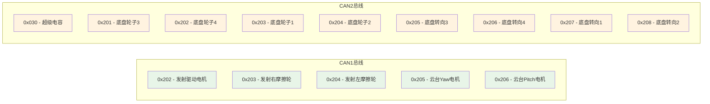
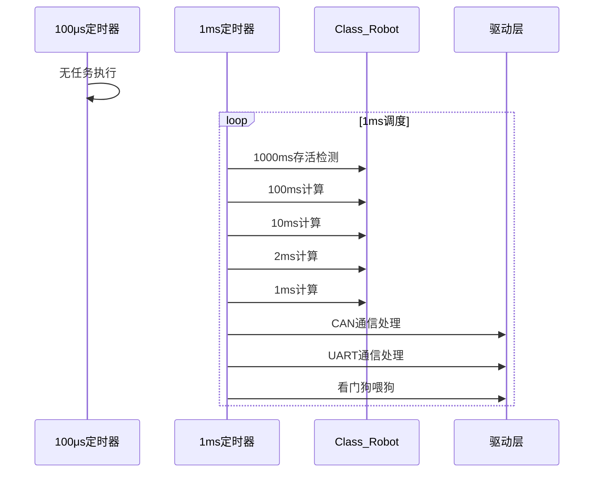

# 任务调度配置与回调函数系统深度解析

## 1. 系统架构图

```mermaid
graph TB
    A[Task_Init/Task_Loop] --> B[Class_Robot]
    A --> C[Class_Serialplot]
    B --> D[Class_Chassis]
    B --> E[Class_Gimbal]
    B --> F[Class_Booster]
    B --> G[Class_Posture]
    B --> H[Class_DR16]
    B --> I[Class_Manifold]
    B --> J[Class_Supercap]
    B --> K[Class_Referee]

    subgraph "任务调度层"
        A
    end
    
    subgraph "机器人层"
        B
    end
    
    subgraph "设备层"
        D E F G H I J K
    end
    
    subgraph "驱动层"
        L[CAN驱动]
        M[UART驱动]
        N[TIM驱动]
        O[IWDG驱动]
    end
    
    style A fill:#e1f5fe
    style B fill:#e8f5e8
    style L fill:#fff3e0
    style M fill:#f3e5f5
    style N fill:#e0f2f1
    style O fill:#ede7f6
```

## 2. 对象分类图

```mermaid
graph LR
    subgraph "专属对象(Specialized)"
        A[Class_Robot的Chassis]
        B[Class_Robot的Gimbal]
        C[Class_Robot的Booster]
    end
    
    subgraph "同类可复用对象(Reusable)"
        D[Chassis的Motor_Wheel[4]]
        E[Chassis的Motor_Steer[4]]
        F[Gimbal的Motor_Yaw/Pitch]
    end
    
    subgraph "通用对象(Generic)"
        G[Posture.AHRS_Chassis]
        H[Posture.AHRS_Gimbal]
    end
    
    style A fill:#e8f5e8
    style B fill:#e8f5e8
    style C fill:#e8f5e8
    style D fill:#fff3e0
    style E fill:#fff3e0
    style F fill:#fff3e0
    style G fill:#f3e5f5
    style H fill:#f3e5f5
```

## 3. 头文件分析 (tsk_config_and_callback.h)

### 3.1 文件概述

这是一个任务调度配置和回调函数的头文件，用于存放个人定义的回调函数和任务，版本0.1于2023年8月29日定稿，1.1版于2023年1月17日更新。

### 3.2 对象分类说明

文件开头详细说明了对象的三种分类：

#### 3.2.1 专属对象 (Specialized)

- **特点**: 单对单独打独
- **示例**: 交互类的底盘对象，只需要交互对象调用且全局只有一个
- **管理方式**: 直接封装在上层类里，初始化和调用都在上层类里

#### 3.2.2 同类可复用对象 (Reusable)

- **特点**: 各调各的
- **示例**: 电机对象，底盘和云台都可以调用不同的对象
- **管理方式**: 直接封装在上层类里，初始化在最近的上层专属对象类里

#### 3.2.3 通用对象 (Generic)

- **特点**: 多个调用同一个
- **示例**: 底盘陀螺仪对象，底盘和云台都要调用
- **管理方式**: 以指针形式指定，初始化在包含所有调用它的上层类里

### 3.3 函数声明

```cpp
extern "C" {
void Task_Init();  // 任务初始化
void Task_Loop();  // 任务循环
};
```

## 4. 实现文件分析 (tsk_config_and_callback.cpp)

### 4.1 包含的头文件

```cpp
#include "4_Interaction/ita_robot.h"        // 交互层机器人
#include "2_Device/Serialplot/dvc_serialplot.h" // 串口绘图
#include "1_Middleware/1_Driver/BSP/drv_djiboarda.h" // BSP驱动
#include "1_Middleware/1_Driver/TIM/drv_tim.h"     // 定时器驱动
#include "1_Middleware/1_Driver/WDG/drv_wdg.h"     // 看门狗驱动
```

### 4.2 全局变量定义

```cpp
bool init_finished = false;  // 全局初始化完成标志
uint32_t flag = 0;           // 计数标志

Class_Robot robot;           // 机器人对象
Class_Serialplot serialplot; // 串口绘图对象

// 串口绘图变量分配列表
static char Serialplot_Variable_Assignment_List[][SERIALPLOT_RX_VARIABLE_ASSIGNMENT_MAX_LENGTH] = {
    "pa", "ia", "da",  // PID参数A
    "po", "io", "do",  // PID参数O
};
```

### 4.3 CAN通信回调函数

#### 4.3.1 CAN1回调函数

```cpp
void Device_CAN1_Callback(Struct_CAN_Rx_Buffer *CAN_RxMessage)
{
    switch (CAN_RxMessage->Header.StdId)
    {
    case (0x202):  // 发射驱动电机
        robot.Booster.Motor_Driver.CAN_RxCpltCallback(CAN_RxMessage->Data);
        break;
    case (0x203):  // 发射右摩擦轮
        robot.Booster.Motor_Friction_Right.CAN_RxCpltCallback(CAN_RxMessage->Data);
        break;
    case (0x204):  // 发射左摩擦轮
        robot.Booster.Motor_Friction_Left.CAN_RxCpltCallback(CAN_RxMessage->Data);
        break;
    case (0x205):  // 云台yaw电机
        robot.Gimbal.Motor_Yaw.CAN_RxCpltCallback(CAN_RxMessage->Data);
        break;
    case (0x206):  // 云台pitch电机
        robot.Gimbal.Motor_Pitch.CAN_RxCpltCallback(CAN_RxMessage->Data);
        break;
    }
}
```

#### 4.3.2 CAN2回调函数

```cpp
void Device_CAN2_Callback(Struct_CAN_Rx_Buffer *CAN_RxMessage)
{
    switch (CAN_RxMessage->Header.StdId)
    {
    case (0x030):  // 超级电容
        robot.Supercap.CAN_RxCpltCallback(CAN_RxMessage->Data);
        break;
    case (0x201):  // 底盘轮子3
        robot.Chassis.Motor_Wheel[2].CAN_RxCpltCallback(CAN_RxMessage->Data);
        break;
    case (0x202):  // 底盘轮子4
        robot.Chassis.Motor_Wheel[3].CAN_RxCpltCallback(CAN_RxMessage->Data);
        break;
    case (0x203):  // 底盘轮子1
        robot.Chassis.Motor_Wheel[0].CAN_RxCpltCallback(CAN_RxMessage->Data);
        break;
    case (0x204):  // 底盘轮子2
        robot.Chassis.Motor_Wheel[1].CAN_RxCpltCallback(CAN_RxMessage->Data);
        break;
    case (0x205):  // 底盘转向3
        robot.Chassis.Motor_Steer[2].CAN_RxCpltCallback(CAN_RxMessage->Data);
        break;
    case (0x206):  // 底盘转向4
        robot.Chassis.Motor_Steer[3].CAN_RxCpltCallback(CAN_RxMessage->Data);
        break;
    case (0x207):  // 底盘转向1
        robot.Chassis.Motor_Steer[0].CAN_RxCpltCallback(CAN_RxMessage->Data);
        break;
    case (0x208):  // 底盘转向2
        robot.Chassis.Motor_Steer[1].CAN_RxCpltCallback(CAN_RxMessage->Data);
        break;
    }
}
```

### 4.4 UART通信回调函数

#### 4.4.1 遥控器回调函数

```cpp
void DR16_UART1_Callback(uint8_t *Buffer, uint16_t Length)
{
    robot.DR16.UART_RxCpltCallback(Buffer, Length);
}
```

#### 4.4.2 串口绘图回调函数

```cpp
void Serialplot_UART2_Callback(uint8_t *Buffer, uint16_t Length)
{
    serialplot.UART_RxCpltCallback(Buffer, Length);
    // 电机调PID参数
    switch (serialplot.Get_Variable_Index())
    {
    case (0):  // P参数A
        robot.Gimbal.Motor_Yaw.PID_AHRS_Angle.Set_K_P(serialplot.Get_Variable_Value());
        break;
    case (1):  // I参数A
        robot.Gimbal.Motor_Yaw.PID_AHRS_Angle.Set_K_I(serialplot.Get_Variable_Value());
        break;
    case (2):  // D参数A
        robot.Gimbal.Motor_Yaw.PID_AHRS_Angle.Set_K_D(serialplot.Get_Variable_Value());
        break;
    case (3):  // P参数O
        robot.Gimbal.Motor_Yaw.PID_AHRS_Omega.Set_K_P(serialplot.Get_Variable_Value());
        break;
    case (4):  // I参数O
        robot.Gimbal.Motor_Yaw.PID_AHRS_Omega.Set_K_I(serialplot.Get_Variable_Value());
        break;
    case (5):  // D参数O
        robot.Gimbal.Motor_Yaw.PID_AHRS_Omega.Set_K_D(serialplot.Get_Variable_Value());
        break;
    }
}
```

#### 4.4.3 视觉系统回调函数

```cpp
void Manifold_UART3_Callback(uint8_t *Buffer, uint16_t Length)
{
    robot.Manifold.UART_RxCpltCallback(Buffer, Length);
}
```

#### 4.4.4 裁判系统回调函数

```cpp
void Referee_UART6_Callback(uint8_t *Buffer, uint16_t Length)
{
    robot.Referee.UART_RxCpltCallback(Buffer, Length);
}
```

#### 4.4.5 底盘姿态传感器回调函数

```cpp
void Chassis_AHRS_UART7_Callback(uint8_t *Buffer, uint16_t Length)
{
    robot.Posture.AHRS_Chassis.UART_RxCpltCallback(Buffer, Length);
}
```

#### 4.4.6 云台姿态传感器回调函数

```cpp
void Gimbal_AHRS_UART8_Callback(uint8_t *Buffer, uint16_t Length)
{
    robot.Posture.AHRS_Gimbal.UART_RxCpltCallback(Buffer, Length);
}
```

### 4.5 定时器回调函数

#### 4.5.1 100微秒定时器回调函数

```cpp
void Task100us_TIM4_Callback()
{
    // 100微秒任务，目前为空
}
```

#### 4.5.2 1毫秒定时器回调函数

```cpp
void Task1ms_TIM5_Callback()
{
    // 模块存活检测
    static int alive_mod100 = 0;
    alive_mod100++;
    if (alive_mod100 == 100)  // 100ms
    {
        alive_mod100 = 0;
        robot.TIM_100ms_Alive_PeriodElapsedCallback();  // 100ms存活检测
    }

    static int alive_mod1000 = 0;
    alive_mod1000++;
    if (alive_mod1000 == 1000)  // 1000ms
    {
        alive_mod1000 = 0;
        robot.TIM_1000ms_Alive_PeriodElapsedCallback();  // 1000ms存活检测
    }

    // 交互层回调函数
    static int interaction_mod100 = 0;
    interaction_mod100++;
    if (interaction_mod100 == 100)  // 100ms
    {
        interaction_mod100 = 0;
        robot.TIM_100ms_Calculate_Callback();  // 100ms计算
    }

    static int interaction_mod10 = 0;
    interaction_mod10++;
    if (interaction_mod10 == 10)  // 10ms
    {
        interaction_mod10 = 0;
        robot.TIM_10ms_Calculate_PeriodElapsedCallback();  // 10ms计算
    }

    static int interaction_mod2 = 0;
    interaction_mod2++;
    if (interaction_mod2 == 2)  // 2ms
    {
        interaction_mod2 = 0;
        robot.TIM_2ms_Calculate_PeriodElapsedCallback();  // 2ms计算
    }

    robot.TIM_1ms_Calculate_Callback();  // 1ms计算

    // 遥控器调试数据发送
    float lx = robot.DR16.Get_Left_X();
    float ly = robot.DR16.Get_Left_Y();
    float rx = robot.DR16.Get_Right_X();
    float ry = robot.DR16.Get_Right_Y();
    float ls = robot.DR16.Get_Left_Switch();
    float rs = robot.DR16.Get_Right_Switch();
    float yaw = robot.DR16.Get_Yaw();
    serialplot.Set_Data(7, &lx, &ly, &rx, &ry, &ls, &rs, &yaw);
    serialplot.TIM_1ms_Write_PeriodElapsedCallback();

    // 驱动层回调函数
    TIM_1ms_CAN_PeriodElapsedCallback();     // CAN通信
    TIM_1ms_UART_PeriodElapsedCallback();    // UART通信
    TIM_1ms_IWDG_PeriodElapsedCallback();    // 看门狗喂狗
    flag++;
}
```

### 4.6 初始化函数

#### 4.6.1 任务初始化函数

```cpp
void Task_Init()
{
    // 驱动层初始化
    BSP_Init(BSP_LED_R_ON | BSP_LED_G_ON);  // 点亮LED，开启24V电源
    
    // CAN总线初始化
    CAN_Init(&hcan1, Device_CAN1_Callback);  // CAN1，用于发射机构和云台
    CAN_Init(&hcan2, Device_CAN2_Callback);  // CAN2，用于底盘和超级电容
    
    // UART初始化
    UART_Init(&huart1, DR16_UART1_Callback, 36);      // 遥控器，36字节
    UART_Init(&huart2, Serialplot_UART2_Callback, SERIALPLOT_RX_VARIABLE_ASSIGNMENT_MAX_LENGTH);  // 串口绘图
    UART_Init(&huart3, Manifold_UART3_Callback, 128); // 视觉系统，128字节
    UART_Init(&huart6, Referee_UART6_Callback, 512);  // 裁判系统，512字节
    UART_Init(&huart7, Chassis_AHRS_UART7_Callback, 128); // 底盘姿态传感器，128字节
    UART_Init(&huart8, Gimbal_AHRS_UART8_Callback, 128);  // 云台姿态传感器，128字节
    
    // 定时器初始化
    TIM_Init(&htim4, Task100us_TIM4_Callback);  // 100微秒定时器
    TIM_Init(&htim5, Task1ms_TIM5_Callback);    // 1毫秒定时器
    
    // 独立看门狗喂狗
    IWDG_Independent_Feed();

    // 设备层初始化
    serialplot.Init(&huart2, Serialplot_Checksum_8_ENABLE, 9, (char **) Serialplot_Variable_Assignment_List);

    // 交互层初始化
    robot.Init();  // 机器人初始化

    // 使能调度时钟
    HAL_TIM_Base_Start_IT(&htim4);  // 启动100微秒定时器中断
    HAL_TIM_Base_Start_IT(&htim5);  // 启动1毫秒定时器中断
    
    // 标记初始化完成
    init_finished = true;

    // 等待系统稳定
    HAL_Delay(2000);
}
```

### 4.7 循环任务函数

#### 4.7.1 任务循环函数

```cpp
void Task_Loop()
{
    robot.Loop();  // 机器人循环任务
}
```

## 5. 通信协议映射图



## 6. 定时器调度时序图



## 7. 关键特性分析

### 7.1 分层架构

- **驱动层**: 硬件抽象层，包括CAN、UART、TIM、IWDG等
- **设备层**: 具体设备驱动，如遥控器、视觉系统等
- **交互层**: 机器人高层控制逻辑
- **任务层**: 顶层任务调度

### 7.2 通信管理

- **多总线通信**: CAN1和CAN2分别管理不同设备
- **多协议支持**: UART支持多种设备通信
- **回调机制**: 统一的回调函数处理通信事件

### 7.3 定时器调度

- **多频率调度**: 100μs和1ms两种频率
- **分层调度**: 不同周期的任务在不同层级执行
- **实时性保证**: 严格的定时执行保证实时性

## 8. 类的作用域和外设资源

### 8.1 作用域

- **全局作用域**: Task_Init和Task_Loop函数
- **文件作用域**: 私有变量和回调函数
- **对象作用域**: Class_Robot和Class_Serialplot对象

### 8.2 使用的外设资源

- **CAN接口**: hcan1(发射/云台), hcan2(底盘/超级电容)
- **UART接口**: huart1-8(各种设备通信)
- **定时器**: htim4(100μs), htim5(1ms)
- **看门狗**: IWDG独立看门狗
- **GPIO**: LED指示灯
- **电源管理**: 24V电源控制

### 8.3 工作流程

1. **系统初始化**: 配置所有硬件接口和设备
2. **通信建立**: 建立CAN和UART通信通道
3. **定时器启动**: 启动定时器中断服务
4. **任务调度**: 通过定时器中断执行不同频率的任务
5. **数据处理**: 在中断中处理通信数据
6. **控制执行**: 执行机器人控制逻辑

这个任务调度系统是一个完整的嵌入式机器人控制系统的核心，通过分层架构和回调机制，实现了高效的多设备通信和实时控制。